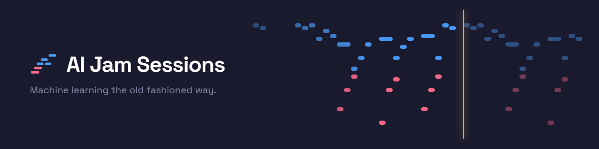
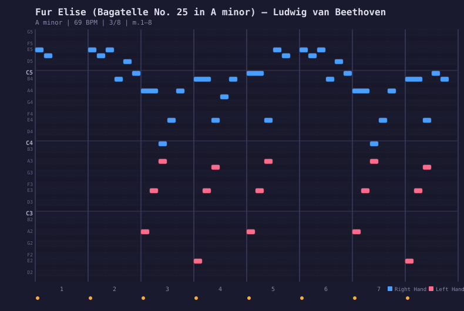
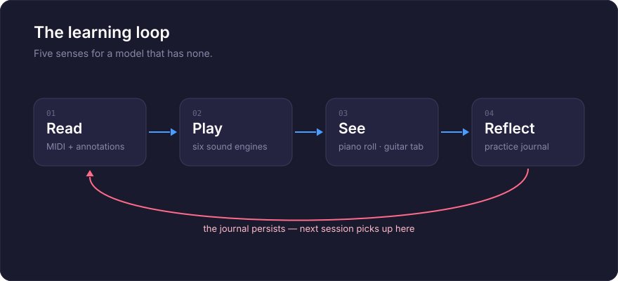

<p align="center">
  <a href="README.ja.md">日本語</a> | <a href="README.zh.md">中文</a> | <a href="README.es.md">Español</a> | <a href="README.md">English</a> | <a href="README.hi.md">हिन्दी</a> | <a href="README.it.md">Italiano</a> | <a href="README.pt-BR.md">Português (BR)</a>
</p>

<p align="center">
  
</p>

<p align="center">
  <em>Machine Learning the Old Fashioned Way</em>
</p>

<p align="center">
  An MCP server that teaches AI to play piano and guitar — and sing.<br/>
  109 annotated songs across 12 genres. Six sound engines. Interactive guitar tablature.<br/>
  A browser cockpit with vocal synthesizer. A practice journal that remembers everything.
</p>

<p align="center">
  <a href="https://github.com/mcp-tool-shop-org/ai-jam-sessions/actions/workflows/ci.yml"></a>
  <a href="https://codecov.io/gh/mcp-tool-shop-org/ai-jam-sessions"></a>
  <a href="https://www.npmjs.com/package/@mcptoolshop/ai-jam-sessions"></a>
  <a href="https://github.com/mcp-tool-shop-org/ai-jam-sessions"></a>
  <a href="https://github.com/mcp-tool-shop-org/ai-jam-sessions"></a>
  <a href="datasets/jam-actions-v0-public/README.md"></a>
  <a href="https://doi.org/10.5281/zenodo.20279918"></a>
</p>

---

## Écoutez d’abord : trois hymnes, chantés en rythme

**[Amazing Grace, America the Beautiful et le Battle Hymn of the Republic](https://mcp-tool-shop-org.github.io/ai-jam-sessions/#listen)**,
chaque couplet, chanté par une voix synthétique sur un arrangement de piano écrit pour chaque hymne. La page d’accueil les diffuse avec une partition 3D
qui suit la voix et les paroles, celles-ci s’allumant au fur et à mesure qu’elles sont chantées.

Chaque interprétation a été assemblée à partir de seize prises d’un chanteur dont l’interprétation est basée sur la partition :
- une prise par phrase, choisie par un auditeur local et un détecteur de hauteur ;
- placée sur la partition par décalage temporel, de sorte que rien à l’intérieur d’une phrase ne soit coupé ;
- vérifiée par deux instruments de mesure du tempo et deux détecteurs de hauteur ;
- validée à l’oreille, chaque problème étant marqué dans une évaluation qui le relie à sa cause.

Un test sonore avant chaque chanson mesure l’empreinte temporelle de la voix et indique le nombre de prises nécessaires pour la chanson.

Comment cela a été fait : [manuel → Voix](https://mcp-tool-shop-org.github.io/ai-jam-sessions/handbook/vocals/).

| | Amazing Grace | America the Beautiful | Battle Hymn |
|---|---|---|---|
| syllabes dans un rayon de 40 ms par rapport à la partition | 107 sur 112 | 217 sur 224 | 285 sur 414 |
| notes dans un rayon de 50 cents | 135 sur 140 | 218 sur 224 | 368 sur 424 |

Les notes pointées rapides du Battle Hymn sont laissées au rythme du chanteur, ce qui est la source de la plupart de ses erreurs de synchronisation.

La voix est synthétique : [SoulX-Singer](https://github.com/Soul-AILab/SoulX-Singer) (Apache-2.0), avec son propre timbre d’exemple,
imitant aucun chanteur réel. Les arrangements de piano ont été écrits pour ce projet par Kimi-K3 et sont dédiés au
domaine public (CC0). Les trois hymnes sont dans le domaine public.

## Qu'est-ce que c'est ?

Un piano et une guitare que l'IA apprend à jouer. Pas un synthétiseur, pas une bibliothèque MIDI, mais un instrument pédagogique.

Un LLM peut lire et écrire du texte, mais il ne peut pas apprécier la musique comme nous le faisons. Pas d'oreilles, pas de doigts, pas de mémoire musculaire. AI Jam Sessions comble cette lacune en donnant au modèle des sens qu'il peut réellement utiliser :

- **Lecture** — partition MIDI réelle avec des annotations musicales approfondies. Pas d’approximations manuscrites, mais des données analysées, interprétées et expliquées.
- **Audition** — six moteurs audio (piano oscillateur, piano échantillonné, échantillons vocaux, tractus vocal physique, synthétiseur vocal additif, guitare modélisée physiquement) qui diffusent le son via vos haut-parleurs, de sorte que les personnes présentes dans la pièce deviennent les « oreilles » de l’IA. Et maintenant, le modèle a ses propres oreilles, et ce, deux fois : il peut mesurer un enregistrement après coup (voir [Écoute](#listening)) et il peut observer le groupe **pendant que la musique est en cours** (voir [L’ensemble en direct](#the-live-ensemble)).
- **Vision** — un piano-rouleau qui affiche ce qui a été joué sous forme de SVG, que le modèle peut relire et vérifier. Un éditeur interactif de tablatures de guitare. Un cockpit de navigateur avec un clavier visuel, un éditeur de notes à deux modes et un laboratoire d’accordage.
- **Mémorisation** — un journal de pratique qui persiste entre les sessions, de sorte que l’apprentissage s’accumule avec le temps.
- **Chant** — synthèse du tractus vocal avec 20 préréglages de voix, allant du soprano lyrique au chœur électronique. Mode de chant avec solfège, contour et narration des syllabes. Et des chansons entières chantées au rythme du piano : un chanteur dont l’interprétation est basée sur la partition, guidé par l’arrangement de la chanson, assemblé phrase par phrase à partir de nombreuses prises et limité en termes de timing (40 ms) et de hauteur (50 cents) avant que vous ne l’entendiez — voir [Chant](#sing).

Chacune des 109 chansons est maintenant entièrement annotée : contexte historique, analyse structurelle barre par barre, moments clés, objectifs pédagogiques et conseils d’interprétation, dans les 12 genres. Une version antérieure de ce fichier README indiquait que les chansons brutes « attendaient que l’IA assimile les motifs, joue la musique et rédige ses propres annotations ». C’est exactement ce qui s’est passé : les annotations ont été rédigées par l’IA sur la base d’une analyse déterministe par chanson (accords, structure de répétition, limites des sections, tonalités vérifiées), limitées par une grille de qualité et vérifiées de manière contradictoire, affirmation par affirmation : les numéros de mesure, les fenêtres d’accords et les décomptes structurels sont tous vérifiés par rapport au MIDI réel avant que quoi que ce soit ne soit publié.

À partir de ce même travail, nous publions également **[jam-actions-v0](#training-dataset)** — un ensemble de données public de 57 séquences d'utilisation d'outils MCP en plusieurs étapes sur du piano classique réel. Il enseigne aux LLM à effectuer une *utilisation d'outils basée sur des données musicales symboliques*, et pas seulement à générer du texte, et est livré avec une grille de publication à 7 axes qui distingue « la transmission de preuves » de « la transmission parce que la tâche est triviale ». Voir [Ensemble de données d'entraînement](#training-dataset) ci-dessous pour tous les détails.

## Écoute

Pendant longtemps, ce serveur pouvait produire du son, mais pas l’analyser. Le modèle jouait, un humain
écoutait, et le modèle se basait sur son avis. Cette lacune est désormais comblée.

Si vous le pointez vers un fichier WAV, il mesure ce qu’il contient. Pas en regardant une image et en devinant, mais en
faisant passer le signal à travers les mêmes types d’outils qu’il utilise déjà sur la partition :

- **`analyze_audio`** — débuts, le contour de la hauteur et le niveau. La hauteur est renvoyée sous forme de noms de notes avec
des déviations en cents, jamais sous forme de fréquences brutes. Le niveau signifie les valeurs réelles maintenant : BS.1770-4
intensité intégrée en LUFS, le pic d’échantillon en dBFS et un nombre d’échantillons coupés, ainsi qu’une
vérification d’intégrité qui signale les coupures et les pics de bruit : la moitié de la vérification de la qualité du rendu qui concerne les clics et les parasites.
Une section « Équilibre » indique où se situe l’énergie, des basses aux aigus : la part de chaque bande par rapport
au bruit rose, la brillance et l’inclinaison.
- **`transcribe_audio`** — l’enregistrement sous forme de notes : hauteur, début, durée et écart de chaque note
par rapport à la hauteur de référence.
- **`score_audio_take`** — évalue une interprétation par rapport à une chanson de la bibliothèque **à l’oreille**. Il
transcrit l’enregistrement, le compare à la partition et indique quelles notes ont été jouées, lesquelles ont dévié et lesquelles ont été manquées. Ensuite, `view_scored_piano_roll` affiche le résultat sur la partition,
exactement comme il le fait pour une prise MIDI enregistrée. C’est ainsi que vous évaluez un instrument réel, une prise chantée ou tout ce pour quoi il n’y a pas de MIDI à enregistrer.
- **`view_spectrogram`** — voyez le son. Un spectrogramme à Q constant avec un clavier de piano sur le bord gauche,
de sorte que la hauteur soit lisible en un coup d’œil, et que les notes de la chanson soient affichées dessus, sur demande.
- **`check_loop_seam`** — évalue un rendu en boucle lorsque celui-ci se répète : le pas de la forme d’onde après
l’extrapolation de la pente de la queue, l’énergie en forme d’impulsion au niveau de la jonction et le décalage de niveau sur
la couture. Une boucle parfaitement en phase est propre, même lorsque l’échantillon de la limite brute saute.
- **`compare_balance`** — le timbre d’un rendu par rapport à une référence dont on sait qu’elle est correcte,
bande par bande en dB. Un indice qui devrait sonner comme ses homologues, un nouveau rendu qui devrait correspondre à
la prise qu’il remplace. La sonorité est annulée, de sorte que seul le timbre est comparé.

**Ce qu’il ne vous dira pas.** L’image sert à déterminer *où* se trouve un problème ; chaque nombre
provient du traitement du signal, jamais d’un modèle qui lit une image. Le transcripteur suit une
ligne à la fois, de sorte qu’un accord ou un mixage complet produira quelque chose de convaincant, mais incorrect, et il le signale. La détection des débuts de notes atteint environ F1 0,88, ce qui signifie qu’une note « manquée » peut être une note que le
transcripteur n’a pas pu entendre, plutôt qu’une note que vous n’avez pas jouée ; les outils incluent cette réserve dans leurs
propres résultats, au lieu de la dissimuler ici.

L’ensemble de la structure est indépendant : la transformation, le suivi de la hauteur, le détecteur de débuts de notes, le
décodeur WAV et l’encodeur PNG sont tous dans ce dépôt, et ils produisent des nombres identiques dans Node
et dans le navigateur.

## L’ensemble en direct

L’évaluation d’une écoute se fait une fois l’enregistrement terminé. Voici l’autre moitié : demander ce que chaque
instrument fait **en ce moment**, pendant l’exécution.

```
ensemble_now()
```

Il répond en indiquant les notes tenues de chaque instrument, la durée pendant laquelle chaque note a été tenue et l’accord combiné
dans l’ensemble. Pendant un duo, les deux voix sont signalées séparément, de sorte que vous pouvez voir le piano maintenir un accord de trois notes tandis que le synthétiseur porte la mélodie.

### Deux canaux, et le moins cher est le plus précis

C’est la partie qu’il faut comprendre, car elle détermine quel nombre il faut prendre en compte.

**Intention : ce que chaque moteur était censé jouer.** Lorsque le modèle est celui qui joue, il ne s’agit pas
d’une estimation. Un accord de piano n’est pas quelque chose à transcrire ; ce sont trois notes qui ont été envoyées. Les
notes sont exactes, libres et immédiates.

**Acoustique : ce qui est réellement produit.** Chaque moteur peut diriger sa sortie vers un bus d’analyse privé,
de sorte que chaque instrument est mesuré à la source, sans séparation ni ambiguïté. Ce canal est une
**vérification, pas une découverte** : c’est ainsi que vous apprenez qu’une voix s’est décalée, qu’une prise a été coupée ou qu’un moteur s’est arrêté tout en continuant à recevoir des notes.

Lorsque les deux sont en désaccord, il s’agit d’un fait concernant le rendu, et non d’une correction des notes.

### Ce que cela coûte

L’observation d’un instrument coûte environ **9 microsecondes par appel audio**, contre un bloc de 42,67 ms,
ce qui représente environ 0,02 % du budget audio, mesuré avec zéro échantillon perdu. Un instrument sans observateur attaché ne coûte rien du tout.

### Ce qu’il ne vous dira pas

Le canal acoustique est en retard, et indique de combien : environ 23 ms pour la hauteur et 70 ms pour un début de note confirmé, car un début de note ne peut être confirmé que lorsque l’audio qui le suit est arrivé. Les débuts de notes proches de cette limite sont supprimés plutôt que signalés et annulés ultérieurement.

Le suivi acoustique suit une ligne à la fois, il ne nommera donc pas les notes d’un accord, et il ne prétend pas le faire. Un accord qu’il ne peut pas résoudre est sa limitation connue, plutôt qu’une découverte, et l’ensemble reste silencieux à ce sujet au lieu de crier au loup à chaque accord joué par le piano.

## Le piano-rouleau

Le piano-rouleau est la façon dont l'IA perçoit la musique. Il représente chaque chanson sous forme de SVG : bleu pour la main droite, corail pour la main gauche, avec des grilles de temps, des nuances et des limites de mesures :

<p align="center">
  
</p>

<p align="center"><em>Für Elise, measures 1–8 — the E5-D#5 trill in blue, bass accompaniment in coral</em></p>

Deux modes de couleur : **main** (bleu/corail) ou **classe de hauteur** (arc-en-ciel chromatique : chaque Do est rouge, chaque Fa# est cyan). Le format SVG signifie que le modèle peut à la fois voir l'image et lire le balisage pour vérifier la hauteur, le rythme et l'indépendance des mains.

## Le cockpit

Un studio de composition basé sur un navigateur qui se trouve dans ce dépôt à l'adresse [`apps/cockpit`](apps/cockpit) et qui fonctionne en direct à l'adresse **[mcp-tool-shop-org.github.io/ai-jam-sessions/cockpit](https://mcp-tool-shop-org.github.io/ai-jam-sessions/cockpit/)**. Pas de plugins, pas de DAW, pas d'installation ; tout reste dans votre navigateur (votre travail est automatiquement enregistré localement). Vous préférez le modifier ?

```bash
cd apps/cockpit && npm install && npm run dev   # Vite dev server, opens in your browser
```

- **Un piano à queue échantillonné par défaut** : le cockpit est livré avec un ensemble de sons de piano Salamander Grand réduit (90 fichiers OGG, 8 Mo) qui se charge lors de votre première interaction et est joué via la même chaîne de sortie que les voix du synthétiseur ; avant qu'il ne se charge (ou hors ligne), le piano à oscillateur accordé prend le relais de manière transparente. Échantillons de [Alexander Holm](https://freepats.zenvoid.org/Piano/acoustic-grand-piano.html), CC-BY 3.0.
- **Mode panneau — la salle d'écoute** : auditions comparatives à l'aveugle, par paires, des voicings du moteur de composition sur de véritables mélodies de bibliothèque : extraits de volume égal rendus hors ligne via le chemin de la voix réelle, essais aléatoires avec des essais de seuil cachés, classements Bradley-Terry avec des intervalles de confiance bootstrap et résultats honnêtes (PROVISOIRES jusqu'à ce que chaque paire atteigne son budget de votes ; NON INTERPRÉTABLES lorsque le seuil de discrimination est atteint). Un deuxième sous-mode exécute le même classement avec des juges LLM locaux, ainsi qu'un historique pour les deux types d'exécution et une vue de comparaison (Kendall τ + correspondance du classement du moteur) qui permet de savoir si les pistes de substitution bon marché suivent la vérité humaine.
- **Transport précis au rythme** : les notes existent dans le temps musical, de sorte que le contrôle du BPM modifie réellement le tempo de lecture ; une règle de temps avec clic pour rechercher et une possibilité de faire glisser pour définir les **régions de boucle** ; défilement automatique qui suit la tête de lecture
- **Capture avec activation de l'enregistrement** : jouez les touches QWERTY, le clavier à l'écran ou un appareil Web MIDI, et cela se retrouve dans la partition : 1 mesure d'introduction, superposition de style looper sur les cycles de boucle (ou mode de remplacement), le tempo de la performance brute est préservé dans une vue quantifiée, chaque passage est une unité unique qui peut être annulée
- **Annulation/rétablissement complet** : chaque modification, y compris Effacer et Importer, est réversible (Ctrl+Z), les gestes de glissement se combinant de la même manière que dans les éditeurs réels
- **Sélection multiple + presse-papiers** : sélection par rectangle sous un outil de sélection/dessin, clics avec modificateurs standard de la plateforme, copier/couper/coller à la tête de lecture, Dupliquer
- **Tactile + accessibilité** : événements de pointeur avec capture sur chaque surface, tapoter pour redéfinir comme alternative à la glisse, édition des notes au clavier, superpositions de partitions sans danger pour les daltoniens
- **Piano-rouleau à double mode** : basculez entre le mode Instrument (couleurs de classe de hauteur chromatique) et le mode Vocal (notes colorées en fonction de la forme de la voyelle : /a/ /e/ /i/ /o/ /u/)
- **Clavier visuel** : deux octaves à partir de Do4, mappées à votre clavier QWERTY. Cliquez ou tapez.
- **20 préréglages de voix** : 15 voix mappées Kokoro (Aoede, Heart, Jessica, Sky, Eric, Fenrir, Liam, Onyx, Alice, Emma, Isabella, George, Lewis, plus chœur et voix de synthé), 4 voix mappées de tractus et une section de chœur synthétique
- **10 préréglages d'instruments** : les 6 voix de piano côté serveur plus synthé-pad, orgue, cloche et cordes
- **Inspecteur de notes** : cliquez sur n'importe quelle note pour modifier la vélocité, la voyelle et la sonorité
- **7 systèmes d'accordage** : tempérament égal, intonation juste (majeur/mineur), pythagoricien, tempérament à quart de virgule, Werckmeister III ou décalages de cent personnalisés. Référence A4 réglable (392–494 Hz).
- **Audit d'accordage** : tableau de fréquences, testeur d'intervalles avec analyse de la fréquence de battement et exportation/importation de l'accordage
- **Importation/exportation de partitions** : sérialisez l'ensemble de la partition au format JSON et chargez-la
- **API orientée LLM** : `window.__cockpit` expose `exportScore()`, `importScore()`, `addNote()`, `play()`, `stop()`, `panic()`, `setMode()` et `getScore()` afin qu'un LLM puisse composer, arranger et lire en programme

## La boucle d'apprentissage

<p align="center">
  
</p>

## La bibliothèque de chansons

109 chansons annotées dans 12 genres, créées à partir de fichiers MIDI réels. Chaque genre a un exemple annoté en profondeur, avec un contexte historique, une analyse harmonique barre par barre, des moments clés, des objectifs pédagogiques et des conseils d’interprétation (y compris des conseils vocaux). Ces exemples servent de modèles : l’IA en étudie un, puis annote les autres. L’exemple du genre folk est **America the Beautiful** (Samuel A. Ward, 1882, domaine public) : un hymne en fa majeur arrangé dans ce dépôt, mélodie de F4 à C5.

**What ships, and what you fetch.** The annotations are ours and ship with every song. The MIDI files were downloaded from public MIDI sites when the library was built, and a per-file provenance audit ([`docs/findings/library-provenance-audit.md`](docs/findings/library-provenance-audit.md)) found that only 14 of those downloads carry a licence that permits redistribution — Bernd Krueger's piano-midi.de arrangements (CC-BY-SA-3.0-DE) and the Mutopia Project's public-domain typesettings. Those 14 are in the npm package. The other 94 downloads are not: their `.json` ships, with a `provenance` block naming the source, its terms and the file's SHA-256, and `ai-jam-sessions library fetch --accept-source-terms` downloads each one from the site that published it, under that site's terms, refusing any file whose hash no longer matches what the annotations were verified against. Twelve files that turned out to be a different piece than their name were quarantined, which is why that downloaded library is 108 songs and not the 120 earlier versions claimed. **America the Beautiful** is the 109th song and the fifteenth MIDI the package ships: the arrangement was made here and dedicated to the public domain. Versions before 2.6.0 shipped all 120 MIDI files; that was a mistake, and it is corrected here rather than papered over.

| Genre | Exemple | Clé | Ce que cela enseigne |
|-------|----------|-----|-----------------|
| Blues | The Thrill Is Gone (B.B. King) | Si mineur | Forme de blues mineur, question-réponse, jeu en contretemps |
| Classique | Für Elise (Beethoven) | La mineur | Forme de rondo, différenciation du toucher, discipline du pédalage |
| Film | Comptine d’un autre été (Tiersen) | Mi mineur | Textures arpégées, architecture dynamique sans changement harmonique |
| Musique folklorique | America the Beautiful (Ward) | Fa majeur | Harmonie d’hymne tonique-dominante, phrasé patriotique, mélodie en Fa4–Do5 |
| Jazz | Autumn Leaves (Kosma) | Sol mineur | Progressions ii-V-I, notes directrices, croches en swing, accords sans fondamentale |
| Musique latine | The Girl from Ipanema (Jobim) | Fa majeur | Rythme de bossa nova, modulation chromatique, retenue vocale |
| New-Age | River Flows in You (Yiruma) | La majeur | Reconnaissance I-V-vi-IV, arpèges fluides, rubato |
| Pop | Imagine (Lennon) | Do majeur | Accompagnement arpégé, retenue, sincérité vocale |
| Ragtime | The Entertainer (Joplin) | Do majeur | Basse « oom-pah », syncopation, forme à plusieurs parties, discipline du tempo |
| R&B | Superstition (Stevie Wonder) | Mi bémol mineur | Funk en doubles croches, clavier percussif, notes fantômes |
| Rock | Your Song (Elton John) | Mi bémol majeur | Mélodie de ballade au piano, renversements, chant conversationnel |
| Soul | Lean on Me (Bill Withers) | Do majeur | Mélodie diatonique, accompagnement gospel, question-réponse |

Les morceaux progressent de **brut** (MIDI uniquement) à **annoté** à **prêt** (totalement jouable avec un langage musical). L’IA fait progresser les morceaux en les étudiant et en rédigeant des annotations avec `annotate_song`.

## Moteurs sonores

Six moteurs, plus un combinateur en couches qui exécute simultanément deux d’entre eux :

| Moteur | Type | Son |
|--------|------|---------------------|
| **Oscillator Piano** | Synthèse additive | Piano multi-harmonique avec bruit de marteau, inharmonicité, brillance modulée par la vélocité, polyphonie à 48 voix, imagerie stéréo. Aucune dépendance. |
| **Sample Piano** | Lecture d’échantillons | Salamander Grand Piano — le vrai son. **Le moteur par défaut lorsqu’un ensemble est installé** (`samples/AccurateSalamander` ou `AI_JAM_SAMPLES_DIR`) ; le fichier tar npm reste sans échantillon, vous fournissez donc le téléchargement [Salamander](https://freepats.zenvoid.org/Piano/acoustic-grand-piano.html). Le cockpit du navigateur est livré avec son propre ensemble réduit de 8 Mo (90 OGG, CC-BY 3.0 Alexander Holm) — aucune configuration sur le Web. |
| **Vocal (Sample)** | Échantillons à hauteur modifiée | Tons de voyelles soutenus avec portamento et mode legato. |
| **Vocal Tract** | Modèle physique | Pink Trombone — onde glottale LF à travers un guide d’ondes numérique à 44 cellules. Quatre préréglages : soprano, alto, ténor, basse. |
| **Vocal Synth** | Synthèse additive | 15 préréglages de voix Kokoro avec mise en forme de formants, souffle, vibrato. Déterministe (générateur de nombres aléatoires avec amorçage). |
| **Guitar** | Synthèse additive | Corde pincée modélisée physiquement — 4 préréglages (dreadnought en acier, classique en nylon, jazz arche, douze cordes), 8 accordages, 17 paramètres réglables. |
| **Layered** | Combinateur | Enveloppe deux moteurs et transmet chaque événement MIDI aux deux — piano+synthé, voix+synthé, etc. |

### Voix de clavier

Six voix de piano réglables, chacune ajustable par paramètre (brillance, durée, dureté du marteau, désaccord, largeur stéréo, etc.) :

| Voix | Caractère |
|-------|-----------|
| Concert Grand | Riche, ample, classique |
| Upright | Chaud, intime, folk |
| Electric Piano | Soie, jazz, ambiance Fender Rhodes |
| Honky-Tonk | Désaccordé, ragtime, saloon |
| Music Box | Cristallin, éthéré |
| Bright Grand | Perçant, contemporain, pop |

### Voix de guitare

Quatre préréglages de voix de guitare avec synthèse de cordes modélisée physiquement, chacun avec 17 paramètres réglables (brillance, résonance du corps, position de pincement, amortissement des cordes, etc.) :

| Voix | Caractère |
|-------|-----------|
| Steel Dreadnought | Brillant, équilibré, acoustique classique |
| Nylon Classical | Chaud, doux, arrondi |
| Jazz Archtop | Doux, boisé, clair |
| Twelve-String | Chatoyant, doublé, semblable à un chorus |

## Le journal de pratique

Après chaque session, le serveur enregistre ce qui s’est passé — quel morceau, quelle vitesse, combien de mesures, combien de temps. L’IA ajoute ses propres réflexions : ce qu’elle a remarqué, quels schémas elle a reconnus, ce qu’il faut essayer ensuite.

```markdown
---
### 14:32 — Autumn Leaves
**jazz** | intermediate | G minor | 69 BPM × 0.7 | 32/32 measures | 45s

The ii-V-I in bars 5-8 (Cm7-F7-BbMaj7) is the same gravity as the V-i
in The Thrill Is Gone, just in major. Blues and jazz share more than the
genre labels suggest.

Next: try at full speed. Compare the Ipanema bridge modulation with this.
---
```

Un fichier Markdown par jour, stocké dans `~/.ai-jam-sessions/journal/`. Lisible par l’homme, ajout uniquement. Lors de la prochaine session, l’IA lit son journal et reprend là où elle s’était arrêtée.

## Ensemble d’entraînement

**jam-actions-v0** — un ensemble de données public de traces d’utilisation d’outils MCP sur plusieurs tours, basé sur des fichiers MIDI de piano classique. Construit à partir de la même bibliothèque que ce serveur utilise pour l’enseignement, l’ensemble de données enseigne aux LLM comment effectuer une **utilisation d’outils basée sur des données sur de la musique symbolique** — et pas seulement de la génération de texte.

Chaque enregistrement associe une séquence de 4 mesures à un objectif pédagogique annoté et à une *trace cible* — une session étape par étape dans laquelle un assistant utilise les outils MCP mentionnés ci-dessus (`get_events_in_measure`, `get_events_in_hand`, `count_distinct_pitch_classes` et le reste de la surface d’inspection MIDI composée de 9 outils) pour lire, analyser et discuter de la séquence.

| | |
|---|---|
| Version | **0.6.0 (25-09-2026) — version de correction** (voir ci-dessous) |
| Enregistrements | 57 (sous-ensemble public) : 45 pour l’entraînement, 12 pour le test (`clair-de-lune`) |
| Compositions | 4 œuvres classiques pour piano : Bach BWV 846, Mozart K. 545 I, Beethoven « Für Elise », Debussy « Clair de lune » |
| Source MIDI | piano-midi.de — arrangements de Bernd Krueger, chaque fichier portant le crédit de droit d’auteur de Krueger |
| Licence | CC-BY-SA-3.0-DE (arrangements) pour les compositions du domaine public |
| Où | [`mcp-tool-shop/jam-actions-v0`](https://huggingface.co/datasets/mcp-tool-shop/jam-actions-v0) on Hugging Face and on Zenodo; DOIs and citation in the [dataset card](datasets/jam-actions-v0-public/README.md) and [`CITATION.cff`](datasets/jam-actions-v0-public/CITATION.cff) |

**La correction 0.6.0.** Les versions 0.4.x et 0.5.x contenaient 115 enregistrements répartis sur 8 œuvres, tous attribués à Bernd Krueger. Cette attribution a été vérifiée par rapport aux pages du compositeur sur piano-midi.de, et non par rapport aux fichiers. Lorsque la bibliothèque de chansons a été auditée à partir des octets MIDI, il s’est avéré que quatre de ces chansons — le Nocturne op. 9 n° 2 et le Prélude op. 28 n° 4 de Chopin, la « Pathétique » II de Beethoven et le « Träumerei » de Schumann — avaient été créées à partir de fichiers obtenus sur midiworld.com et bitmidi.com, sans licence d’arrangement établie. Leurs 58 enregistrements contenaient ces arrangements note par note, de sorte que la version 0.6.0 les retire. Les 57 enregistrements restants sont identiques à ceux de la version 0.5.0. Veuillez ne pas redistribuer les enregistrements retirés des versions antérieures. Le compte rendu complet se trouve dans [`docs/findings/published-dataset-licence-audit.md`](docs/findings/published-dataset-licence-audit.md).

**La validation des preuves.** Le programme d’empaquetage relit maintenant le bloc de provenance de chaque chanson — recalculé à partir des octets MIDI — et refuse tout enregistrement dont la chanson ne dispose pas d’une licence d’arrangement redistribuable, ou dont le hachage du fichier source diffère du fichier dont la provenance est prouvée. Il fonctionne en mode sécurisé. Un test exécute à nouveau la même vérification sur chaque paquet publié, de sorte qu’un changement de provenance ultérieur fait passer la compilation en rouge pour les ensembles publiés.

**Évaluation de la qualité — la validation sur 7 axes.** La validation de l’ensemble de données distingue la validation basée sur des preuves de la validation qui atteint un seuil maximal. Les axes 1 à 6 sont bloquants (seuil absolu, seuil composé, taux d’utilisation des outils, correction après l’utilisation d’un outil, nombre d’interprétations erronées, seuil de la couche) ; l’axe 7 est une comparaison entre les données enrichies et les données non enrichies. Les résultats enregistrés ont été mesurés sur les 115 enregistrements des versions 0.4.x et 0.5.x et peuvent être reproduits à partir de la balise `jam-actions-v0-0.5.0-cut-2026-07-11` ; ils n’ont pas été remesurés dans la version 0.6.0.

**Reproductibilité.** Un nouveau contributeur sur n’importe quelle plateforme (Windows natif, macOS, Linux, WSL) peut vérifier le paquet et le reconstruire :

```bash
git clone https://github.com/mcp-tool-shop-org/ai-jam-sessions.git
cd ai-jam-sessions && pnpm install
pnpm exec tsx scripts/verify-public-package-checksums.ts                        # every file accounted for
pnpm exec tsx scripts/package-jam-actions-public.ts --today 2026-09-25 --dry-run # evidence gate runs first
pnpm build && pnpm exec tsx scripts/verify-public-package-execution.ts
# → "VERDICT: PASS" — every frozen tool call replays live (needs an audio device)
```

`.gitattributes` fixe les fins de ligne LF pour `*.sha256` et l’arborescence du jeu de données public afin que le vérificateur de sommes de contrôle fonctionne sur toutes les plateformes.

**Historique du réglage fin.** Les affirmations de l’ensemble de données ont été testées avec des réglages fins préenregistrés, évalués par rapport à des valeurs de référence scellées. **v0** (les 78 séquences d’improvisation seules) a donné un résultat négatif honnête ([rapport](docs/finetune-arc-eval-report.md)) ; **v1** a amélioré l’assurance qualité basée sur les outils de +0,202, mais n’a pas atteint la barre préenregistrée d’une seule victoire ([rapport](docs/finetune-arc-v1-eval-report.md)) ; **B-1** a retesté les adaptateurs v1 figés sur un groupe de 36 enregistrements : 0,678 → 0,890, 29/36 victoires par rapport à la barre de 24/34 définie à l’avance ([rapport](docs/finetune-arc-v2-b1-eval-report.md)). Ces mesures sont enregistrées telles quelles. **Les adaptateurs eux-mêmes sont retirés** : leurs données d’entraînement comprenaient des enregistrements des quatre chansons retirées, de sorte qu’ils ne peuvent pas être proposés dans le cadre des conditions de cet ensemble de données. Les adaptateurs entraînés uniquement sur du matériel dont la licence est claire sont publiés avec les ensembles de données `jam-actions-v1`.

> Les arrangements MIDI sont de Bernd Krueger (piano-midi.de), sous licence CC-BY-SA-3.0-DE. Les annotations, les séquences et les artefacts d’évaluation sont de l’équipe AI Jam Sessions, publiés sous la même licence afin de préserver la chaîne de partage de bout en bout. **Limite de la licence** : la licence MIT du dépôt couvre le code ; tout ce qui se trouve sous `datasets/` est sous licence CC-BY-SA-3.0-DE. Le corpus de travail à `datasets/jam-actions-v0/` contient également des enregistrements qui ne sont pas publiés : deux œuvres dont la provenance n’a jamais été vérifiée (Satie Gymnopédie n° 1, Debussy Arabesque n° 1) et les quatre œuvres retirées dans la version 0.6.0 — voir [`datasets/jam-actions-v0/PROVENANCE-NOTE.md`](datasets/jam-actions-v0/PROVENANCE-NOTE.md).

### Le corpus acoustique

**jam-actions-acoustic-v0** — le complément des données mentionnées ci-dessus, appliqué à l’**audio** plutôt qu’à la musique symbolique. 72 enregistrements, chacun associant un rendu synthétique délibérément perturbé d’une phrase du domaine public au résultat que les outils d’analyse renvoient réellement, de sorte que chaque étiquette est vérifiée par rapport à l’instrument plutôt que seulement par rapport à lui-même.

| | |
|---|---|
| Version | 1.1.0 (25-09-2026) — a retiré les 36 enregistrements de « Träumerei » de la version 1.0.x, dont le fichier source ne dispose pas d’une licence d’arrangement établie |
| Enregistrements | 72 — 2 séquences (Bach, Für Elise) × 9 types de perturbations × 4 notes cibles |
| Mis de côté | par **phrase** (Für Elise), et non par enregistrement, de sorte qu’un jumeau perturbé de la même mélodie ne puisse pas être divulgué. |
| Classes | correspondance, échec/avertissement de la hauteur, échec/réussite du timing, note manquante, note supplémentaire, vibrato accordé, silence sans rien à évaluer |
| Audio | aucun n’est distribué : chaque enregistrement contient une recette déterministe et le SHA-256 de la forme d’onde qu’il produit |
| Schéma | `jam-actions-acoustic-v0/1.0.0` |

Deux des neuf classes sont là parce qu’un modèle naïf y répond avec confiance et de manière incorrecte : une note de vibrato dont le verdict correct est *accordée*, et le silence dont le verdict correct est *rien à évaluer*. Chaque seuil dont dépend le verdict est copié dans l’enregistrement, car les deux ont été modifiés une fois pendant la construction.

Le corpus peut être reproduit à partir de ce dépôt. Sa régénération produit tous les 79 fichiers publiés et un fichier `checksums.sha256` identique au niveau de l’octet, et un test confirme exactement cela sans écrire l’arborescence publiée.

**One caveat, measured rather than assumed.** Each record carries `wav_sha256`, the hash of the
waveform its recipe produces, and the renderer calls `Math.pow` and `Math.sin` once per sample.
Neither is required to be correctly rounded, and V8's results changed between Node 22 and Node 24:
of the 27,869 distinct `Math.pow(2, x)` arguments the original corpus evaluated, 253 return a
different double. Almost all of that vanishes under 16-bit quantisation, but **2 of the 72 records**
— both the `extra` perturbation of Für Elise, whose motif sits on the one pitch where the semitone
ratio itself differs — hash differently on Node 24. Every other field of every record reproduces on
any engine, and the repository tests both claims separately. If you re-render and see those two
mismatch, that is this, not a corrupt download. Making the waveform bit-portable means replacing
the transcendentals, which changes every hash and therefore needs a new schema version.

### Créez le vôtre

L’échafaudage sur lequel fonctionne le corpus est disponible pour vos propres expériences.
[`experiments/_template/`](experiments/_template/) est un exemple fonctionnel que vous pouvez copier : déclarez une
tâche, et vous obtenez un formatage SFT, un score par classe, des bases simples sur l’ensemble de verdict déclaré et une vérification qu’aucune unité de test ne chevauche la division.

Le [contrat](experiments/_template/README.md) est la partie qui vaut la peine d’être lue. La vérité terrain est
construite plutôt qu’écrite à la main, les étiquettes sont vérifiées par rapport à ce que les outils mesurent, vous
divisez par l’unité qui présente des fuites, et vous présentez les valeurs de référence et le modèle de base à côté de chaque résultat.
Chacune de ces règles a un coût en termes d’apprentissage.

## Installation

```bash
npm install -g @mcptoolshop/ai-jam-sessions
```

Nécessite **Node.js 22+** (la version 2.0.0 a augmenté le seuil avec `node-web-audio-api` 2.0). Pas de pilotes MIDI, pas de ports virtuels, pas de logiciels externes.

### Claude Desktop / Claude Code

```json
{
  "mcpServers": {
    "ai_jam_sessions": {
      "command": "npx",
      "args": ["-y", "-p", "@mcptoolshop/ai-jam-sessions", "ai-jam-sessions-mcp"]
    }
  }
}
```

### Docker

Chaque version publie également `ghcr.io/mcp-tool-shop-org/ai-jam-sessions`, une image allégée qui exécute le serveur MCP sur stdio. Il est important de savoir que `/data` est la mémoire : le journal, l’état du serveur, les morceaux de musique des utilisateurs et tous les fichiers MIDI téléchargés y sont stockés. Il est donc nécessaire de monter un volume, sinon ils seront perdus lorsque le conteneur sera supprimé.

```json
{
  "mcpServers": {
    "ai_jam_sessions": {
      "command": "docker",
      "args": ["run", "--rm", "-i", "-v", "ai-jam-data:/data", "ghcr.io/mcp-tool-shop-org/ai-jam-sessions"]
    }
  }
}
```

L’image contient les 14 fichiers MIDI redistribuables ; l’exécution de `library fetch --accept-source-terms` une seule fois à l’intérieur du conteneur place les 94 autres fichiers dans le volume. `docker compose up` fait de même avec un volume nommé, et `--profile ollama` ajoute un conteneur annexe Ollama. Pour plus de détails, consultez la documentation sur l’interface en ligne de commande à l’intérieur de l’image et sur ce qui n’y est pas inclus : [docs/docker.md](docs/docker.md). Pour exécuter les évaluateurs affinés dans Ollama, avec le coût mesuré d’une base à 4 bits : [docs/ollama-adapters.md](docs/ollama-adapters.md).

## Outils MCP

56 outils et 4 modèles de requête répartis en huit catégories :

### Apprendre

| Outil | Ce qu’il fait |
|------|--------------|
| `list_songs` | Parcourir par genre, difficulté ou mot-clé |
| `song_info` | Analyse musicale complète — structure, moments clés, objectifs pédagogiques, conseils de style |
| `registry_stats` | Statistiques à l’échelle de la bibliothèque : nombre total de chansons, genres, difficultés |
| `list_measures` | Notes, dynamiques et notes pédagogiques de chaque mesure |
| `teaching_note` | Analyse approfondie d’une seule mesure — doigté, dynamiques, contexte |
| `suggest_song` | Recommandation basée sur le genre, la difficulté et ce que vous avez joué |
| `practice_setup` | Vitesse, mode, paramètres de voix et commande CLI recommandés pour une chanson |
| `compare_songs` | Reconnaissance de motifs intergenres — relations clés, similarité de hauteur/intervalle, formes partagées, liens pédagogiques |
| `annotation_progress` | Suivi de la qualité de l’annotation dans la bibliothèque — scores, notes et suggestions d’amélioration |
| `server_info` | Version du serveur, statistiques de la bibliothèque, liste des moteurs, session active |

### Lire

| Outil | Ce qu’il fait |
|------|--------------|
| `play_song` | Lire via les haut-parleurs — morceaux de la bibliothèque ou fichiers .mid bruts. Quatre moteurs (piano, voix, registre, guitare), vitesse, mode et plage de mesures arbitraires — plus un métronome avec compte et un indicateur `record` qui enregistre la session pour l’évaluation. Le synthétiseur et les moteurs superposés sont accessibles uniquement via l’interface en ligne de commande. |
| `stop_playback` | Arrêter |
| `pause_playback` | Mettre en pause ou reprendre |
| `set_speed` | Modifier la vitesse pendant la lecture (de 0,1× à 4,0×) |
| `playback_status` | Instantané en temps réel : mesure actuelle, tempo, vitesse, voix du clavier, état |
| `view_piano_roll` | Rendre sous forme de SVG (couleur de la main ou arc-en-ciel chromatique des classes de hauteur) |
| `score_performance` | Évaluer une pièce MIDI jouée en accompagnement — précision de la hauteur, rythme, exhaustivité, avec évaluation progressive |
| `mute_hand` | Couper ou rétablir le son de la main gauche/droite pendant l’entraînement — isoler une main à la fois |
| `detect_chord` | Identifier l’accord à partir d’un ensemble de notes MIDI actuellement jouées (par exemple, `[60,64,67]` → Do) |
| `preview_teaching_cues` | Afficher toutes les notes pédagogiques et les moments clés avant de jouer |

### S’entraîner

| Outil | Ce qu’il fait |
|------|--------------|
| `practice_loop` | L’exercice qu’un véritable professeur assignerait : répéter les mesures 5 à 8 plus lentement, et le tempo augmente (+5 %) uniquement après une exécution *réussie* — chaque exécution est enregistrée, évaluée et résumée |
| `practice_status` | État de l’exercice : exécution actuelle, vitesse et diagnostic par mesure de la dernière tentative |
| `score_last_take` | Évaluer la dernière tentative enregistrée — précision de la hauteur, rythme, exhaustivité, évaluation par note |
| `view_scored_piano_roll` | La partition annotée que tout professeur utilise : la partition de piano superposée aux évaluations par note dans une palette adaptée aux personnes daltoniennes (plein = correct, pointillé = rythme, ✕ = manquant) |

### Chanter

| Outil | Ce qu’il fait |
|------|--------------|
| `sing_along` | Texte chantable — noms de notes, solfège, contour ou syllabes. Avec ou sans accompagnement au piano. |
| `ai_jam_sessions` | Générer un bref descriptif pour une improvisation — progression d’accords, esquisse de mélodie et indications de style pour une réinterprétation |
| `verify_harmony` | La porte de vérification de la boucle de création : une réharmonisation proposée est vérifiée par les propres outils déterministes de la plateforme — fidélité de l’accord (le moteur d’accord doit détecter chaque accord prévu), consonance de la mélodie (ton/tension/chromatisme), conduite des voix de la basse, appartenance à la tonalité |
| `auto_reharmonize` | La boucle de création en une seule étape — un modèle local propose une réharmonisation, la porte déterministe de `verify_harmony` vérifie chaque tessiture, le meilleur parmi n jusqu’à ce qu’une interprétation vérifiée soit renvoyée |
| `compose_panel` | Exécuter le panneau de composition des voix sur n’importe quelle chanson : quatre systèmes réalisent des accompagnements, un LLM aveugle et inter-familles évalue et classe les accompagnements, agrégation de Bradley-Terry — avec une porte de discrimination qui invalide les séquences non interprétables (signal directionnel uniquement, jamais un score de qualité). Exécution pendant plusieurs minutes et affichage des notifications de progression pendant son fonctionnement. |

**Un morceau entier sur le rythme : la voie vocale.** N’importe quel morceau peut contenir une véritable partie vocale chantée qui se superpose au piano.
- **Le rythme.** Un métronome (`scripts/build-score-clock.mjs`) dérive le ton, le début et la durée de chaque syllabe à partir de l’arrangement du morceau, sur la propre chronologie du lecteur.
- **Le test sonore.** Avant qu’un morceau ne soit rendu, la même voix chante une phrase de calibration de seize mots au tempo du morceau (`scripts/soundcheck.py`). Son empreinte temporelle, par groupe de consonnes et pour les notes tenues par rapport aux notes courtes, indique de combien de prises le morceau a besoin et quels mots sont risqués, avant que du temps GPU ne soit consacré au morceau lui-même.
- **Le chanteur.** Un chanteur conditionné par la partition ([SoulX-Singer](https://github.com/Soul-AILab/SoulX-Singer), Apache-2.0) rend seize prises à partir de ce métronome, localement ou sur un GPU loué via offrig.
- **La sélection.** `scripts/sing_clock.py --by-phrase --warp` sélectionne une prise par phrase. Une transcription d’un auditeur local et une hauteur FCPE décident, et la phrase est déformée dans le temps pour s’adapter à la partition.
- **Les filtres.** **Rythme :** un détecteur d’énergie, vérifié par un aligneur vocal forcé, place chaque voyelle dans un délai de 40 ms. **Hauteur :** FCPE, avec pYIN qui relit ce qu’il signale, place chaque note dans un délai de 50 cents.
- **L’oreille.** La révision auditive (`scripts/review_marks.py`) permet à une personne d’appuyer sur **M** chaque fois que quelque chose ne sonne pas bien, avec une catégorie et une note. Le rapport retrace chaque marque à sa prise, à son joint et aux filtres, et l’évalue en fonction du niveau de l’examinateur : l’oreille d’un auditeur détermine *où* cela ne sonne pas bien, tandis que le fait de nommer *ce que* c’est a plus de poids en termes de formation. Aujourd’hui, il s’agit d’une page d’écoute locale ; elle sera intégrée au cockpit par la suite. Itinéraire, leviers et reçus : [manuel → Voix](https://mcp-tool-shop-org.github.io/ai-jam-sessions/handbook/vocals/), [`docs/vocal-clock.md`](docs/vocal-clock.md) ; la recherche qui sous-tend les choix : [`docs/vocal-singing-study-2026-09.md`](docs/vocal-singing-study-2026-09.md).

### Guitare

| Outil | Ce qu’il fait |
|------|--------------|
| `view_guitar_tab` | Rendre interactivement la tablature de guitare au format HTML — clic pour modifier, curseur de lecture, raccourcis clavier |
| `list_guitar_voices` | Préréglages de voix de guitare disponibles |
| `list_guitar_tunings` | Systèmes d’accord de guitare disponibles (standard, accordage en mi grave, accordage ouvert en sol, DADGAD, etc.) |
| `tune_guitar` | Ajuster n’importe quel paramètre de n’importe quelle voix de guitare. Les paramètres sont conservés entre les sessions. |
| `get_guitar_config` | Configuration actuelle de la voix de guitare par rapport aux paramètres d’usine |
| `reset_guitar` | Réinitialiser une voix de guitare aux paramètres d’usine |

### Créer

| Outil | Ce qu’il fait |
|------|--------------|
| `add_song` | Ajouter une nouvelle chanson au format JSON |
| `import_midi` | Importer un fichier .mid avec des métadonnées |
| `annotate_song` | Écrire un langage musical pour une chanson brute et la préparer |
| `save_practice_note` | Entrée de journal avec des données de session capturées automatiquement |
| `read_practice_journal` | Charger les entrées récentes pour le contexte |
| `list_keyboards` | Voix de clavier disponibles |
| `tune_keyboard` | Ajuster n’importe quel paramètre de n’importe quelle voix de clavier. Les paramètres sont conservés entre les sessions. |
| `get_keyboard_config` | Configuration actuelle par rapport aux paramètres d’usine |
| `reset_keyboard` | Réinitialiser une voix de clavier aux paramètres d’usine |
| `score_annotation` | Qualité de l’annotation de la partition sur 5 dimensions — exhaustivité, profondeur, spécificité, valeur pédagogique, vocabulaire |
| `validate_song_entry` | Valider un fichier JSON de chanson par rapport au schéma avant de l’ajouter |
| `transpose_song` | Transposer une chanson d’un ou plusieurs demi-tons — nouvelle tonalité, nouvelles notes |
| `list_sections` | Afficher les sections structurelles d’une chanson (introduction, couplet, refrain, etc.) |
| `add_section` | Ajouter un marqueur de section à une chanson pour la navigation structurelle |

### Score

| Outil | Ce qu’il fait |
|------|--------------|
| `score_performance` | Évaluez une interprétation MIDI par rapport à une chanson de la bibliothèque : justesse, rythme, exhaustivité, avec un retour d’information gradué. |
| `score_annotation` | Évaluez la qualité de l’annotation sur 5 dimensions. |

### Écoutez

Mesure de l’audio enregistré. Monophonique : ils suivent une ligne à la fois, donc un accord ou un mixage complet
produit des résultats incohérents. Chaque nombre provient du traitement du signal, jamais d’un modèle qui lit
une image.

| Outil | Ce qu’il fait |
|------|--------------|
| `analyze_audio` | Mesurer un fichier WAV — temps d’attaque, le contour de la hauteur sous forme de noms de notes avec des cents, niveau (BS.1770-4 LUFS, dBFS de crête, échantillons écrêtés), équilibre spectral par bande et test d’intégrité (trous, pics de bruit, clics) |
| `transcribe_audio` | Transformez un enregistrement monophonique en notes, en indiquant la déviation de chaque note par rapport à la hauteur de référence. Les notes que le programme n’a pas pu suivre sont omises plutôt que supposées. |
| `score_audio_take` | Évaluez une interprétation par rapport à une chanson de la bibliothèque **à l’oreille**, puis transmettez le résultat à `view_scored_piano_roll`. |
| `view_spectrogram` | Visualisez le son : un spectrogramme à Q constant sur un axe de clavier de piano, éventuellement superposé aux notes prévues. Masqué par défaut. |
| `check_loop_seam` | Déterminer où la fin d’une boucle revient à son début — étape de forme d’onde extrapolée, énergie de pic au niveau du joint, décalage de niveau à travers celui-ci |
| `compare_balance` | Comparer l’équilibre tonal d’un rendu par rapport à une référence, bande par bande en dB, avec la variation de luminosité et d’inclinaison. La sonorité est annulée. |
| `ensemble_now` | Ce que chaque instrument joue **en ce moment**, pendant l’interprétation. Les notes proviennent de ce qui a été envoyé, elles sont donc exactes plutôt qu’estimées. |

### Invites MCP

Quatre modèles d’invites pour des flux de travail d’enseignement structurés :

| Invite | Ce qu’il fait |
|--------|--------------|
| `annotate_song` | Flux de travail d’annotation guidé — étudier un exemple, écrire un langage musical pour une chanson brute |
| `practice_plan` | Créer un plan d’entraînement structuré basé sur le genre, la difficulté et les objectifs |
| `performance_review` | Examiner une session terminée — ce qui a bien fonctionné, sur quoi se concentrer ensuite |
| `maker_loop` | Effectuer la boucle de création complète — proposer une réharmonisation, la vérifier avec les outils déterministes de la plateforme, puis ajouter et jouer le résultat vérifié |

## Interface en ligne de commande

```
ai-jam-sessions list [--genre <genre>] [--difficulty <level>]
ai-jam-sessions play <song-id> [--speed <mult>] [--mode <mode>] [--engine <piano|vocal|tract|synth|guitar|piano+synth|guitar+synth>] [--metronome] [--count-in <bars>] [--record]
ai-jam-sessions practice <song-id> --measures <start-end> [--start-speed <pct>] [--target <pct>] [--step <pct>]
ai-jam-sessions sing <song-id> [--with-piano] [--engine <engine>]
ai-jam-sessions view <song-id> [--measures <start-end>] [--out <file.svg>]
ai-jam-sessions view-guitar <song-id> [--measures <start-end>] [--tuning <tuning>]
ai-jam-sessions info <song-id>
ai-jam-sessions tune <keyboard-id> [--param value ...] [--reset] [--show]
ai-jam-sessions tune-guitar <voice-id> [--param value ...] [--reset] [--show]
ai-jam-sessions keyboards
ai-jam-sessions guitars
ai-jam-sessions stats
ai-jam-sessions library
ai-jam-sessions ports
ai-jam-sessions help
ai-jam-sessions --version
```

## État

**v2.8.0 : deux hymnes, chantés.** Amazing Grace et America the Beautiful sont chantés en entier, chaque couplet, sur le métronome du piano : seize prises, une prise par phrase, placement de la déformation temporelle, filtres de rythme et de hauteur à deux instruments, et une personne qui écoute à la fin. Les deux ont été validés à l’oreille, et la [page d’accueil](https://mcp-tool-shop-org.github.io/ai-jam-sessions/) commence par eux. Le morceau America the Beautiful de la bibliothèque est désormais la propre mélodie Materna de Ward. Voir [CHANGELOG](CHANGELOG.md).

**v2.7.0 — America the Beautiful.** La bibliothèque contient 109 chansons annotées. Quinze fichiers MIDI sont fournis ; 94 sont toujours récupérés à partir de leurs sources. La nouvelle version est un arrangement du domaine public créé dans ce dépôt (mélodie de Samuel A. Ward, 1882), en do majeur, et il s’agit de l’exemple folklorique. Un module SoulX-Singer l’interprète : les seuils de synchronisation et de hauteur sont respectés, et la page d’accueil conserve les trois avertissements de hauteur. Voir [CHANGELOG](CHANGELOG.md).

**v2.6.0 — la version qui arrête d’inclure les fichiers pour lesquels elle n’avait pas de licence** (voir [CHANGELOG](CHANGELOG.md)).
Un audit de provenance par fichier de la bibliothèque de morceaux a révélé que, sur les 108 arrangements MIDI, 14 comportent une licence qui autorise la redistribution et 94 n’en comportent pas, et que douze fichiers sont des morceaux différents de ceux indiqués par leur nom. Chaque morceau inclut désormais un `provenance` qui est étayé par des preuves (URL de la source, conditions du site, nom de l’arrangeur en tant qu’ayant-droit du fichier, SHA-256, verdict sur le titre) ; les douze fichiers sont mis en quarantaine ; le paquet npm inclut les 14 et indique que les autres ne sont *pas téléchargés*, et `ai-jam-sessions library fetch --accept-source-terms` télécharge chacun d’eux à partir du site qui l’a publié, en respectant les conditions de ce site, et refuse tout fichier dont le hachage ne correspond plus. Les versions antérieures incluaient les 120 fichiers et sont désormais obsolètes sur npm. Le même audit a réinitialisé l’ensemble de données jam-actions-v1 aux onze morceaux dont les arrangements ont été vérifiés (trois Krueger CC-BY-SA-3.0-DE, huit Mutopia Public Domain) ; le corpus, sa sonde de seuil et l’arc d’apprentissage qui a trouvé la cible « morceau affiché » (un LoRA de rang 16 de 3 milliards de paramètres avec une recette inchangée, passant d’une classe antérieure à 54/54 et 72/72 au seuil une fois que l’assistant a écrit les chiffres de la comparaison) se trouvent dans le dépôt sous `datasets/` et `experiments/coverage-v1-sft/`, et leur publication sur Hugging Face et Zenodo suivra, à partir du corpus vérifié. Également dans cette version : `scorePerformance` limite la fenêtre correcte au seuil de l’appelant, de sorte que la règle de 40 ms est exactement la fenêtre de validation.

Dans la version 2.5.0, le modèle peut observer le groupe jouer.
`ensemble_now` indique ce que chaque instrument fait pendant que la musique est en cours : notes tenues par instrument, durée de chaque note et accord combiné. Il fonctionne sur deux canaux, et le moins cher est le plus précis : lorsque ce serveur l’exécute, il sait exactement ce qu’il a envoyé, de sorte qu’un accord est composé de trois notes plutôt que d’un problème de transcription, tandis qu’une mesure acoustique distincte mesure chaque moteur **à la source** pour vérification. Le coût mesuré est d’environ **9 microsecondes par appel audio** ; la latence est indiquée plutôt qu’implicite (~23 ms pour la hauteur, ~70 ms pour le début confirmé) ; et les limites sont documentées car elles sont exploitables : le traqueur est monophonique, les éléments superposés sont mesurés individuellement et jamais en tant que mélange, et un instrument sans mesure n’est pas un instrument silencieux.
La même version transforme la machinerie de l’ensemble de données en un contrat auquel chacun peut se référer, avec un modèle fonctionnel, afin que les utilisateurs puissent créer leurs propres corpus et entraîner leurs propres adaptateurs en utilisant la même approche. En cours de route, il a été constaté que le seuil de reproductibilité du corpus acoustique couvrait 109 de ses 115 chemins publiés, et que trois des six chemins manquants n’avaient jamais été émis par le générateur : la régénération les a supprimés. Une régénération complète reproduit désormais chaque fichier et le manifeste de somme de contrôle, octet par octet. La surface active est composée de **54 outils et de 4 modèles de requête**, avec **3 389 tests réussis sur 165 fichiers (1 saut)**.

Dans la version précédente, v2.4.0, la version où le modèle a acquis une capacité d’écoute. Quatre outils ont réduit l’écart entre
la production audio et son analyse : `analyze_audio` pour les débuts, le contour de la hauteur et le niveau ;
`transcribe_audio` pour un enregistrement monophonique transformé en notes ; `score_audio_take` pour évaluer une interprétation
à l’oreille et transmettre le résultat au piano-rouleau existant, sans modification ; et `view_spectrogram` pour
visualiser le son sur un axe à Q constant, de type clavier de piano. Tout cela est un traitement du signal sans dépendances,
écrit dans ce dépôt : sa propre FFT, ses fenêtres, ses transformations de Mel et à Q constant, la détection des débuts et
le suivi de la hauteur, car un modèle ne peut pas évaluer de manière fiable une image et les requêtes déterministes sont plus efficaces
que l’inférence pour les questions ayant des réponses exactes. Cette version a également publié
**jam-actions-acoustic-v0**, 108 enregistrements de référence constructibles pour l’utilisation des outils sur l’audio.

Dans la version 2.3.0, l’instrument a appris à chanter en rythme (voir [CHANGELOG](CHANGELOG.md)). Chaque chanson de la bibliothèque peut désormais contenir une véritable ligne chantée qui s’intègre au piano : un **métronome** dérive la hauteur, le début et la durée de chaque syllabe à partir du fichier MIDI de la chanson sur la propre chronologie du lecteur ; un chanteur local, Apache-2.0, conditionné par le score ([SoulX-Singer](https://github.com/Soul-AILab/SoulX-Singer)) l’interprète ; et deux seuils mesurent l’artefact avant que quoi que ce soit ne soit considéré comme un mélange : synchronisation (chaque voyelle dans les 40 ms du score) et hauteur (chaque note dans les 50 cents). L’exécution fournie d’Amazing Grace mesure 6 ms pour la pire synchronisation et −2,7 cents pour la hauteur globale, avec les preuves enregistrées ; la page d’accueil l’affiche comme un état honnête, avec le seul défaut restant nommé (le raccord d’ouverture). Le module, ses leviers et la recherche qui sous-tend chaque choix (cinq axes d’étude, cités) se trouvent dans le [manuel](https://mcp-tool-shop-org.github.io/ai-jam-sessions/handbook/vocals/) et [`docs/`](docs/). La surface active reste inchangée, avec **49 outils et 4 modèles de requête**, et **3 080 tests réussis (1 saut)**, ainsi que la propre suite de tests pytest de l’instrument vocal. **État de la publication :** publié — [`@mcptoolshop/ai-jam-sessions@2.3.0`](https://www.npmjs.com/package/@mcptoolshop/ai-jam-sessions) sur npm, avec preuve de provenance.

Dans la version 2.2.0 — la version où l’instrument a acquis une véritable capacité d’écoute et une salle d’écoute. Le piano par défaut du cockpit est désormais un **piano à queue échantillonné** — un ensemble Salamander réduit qui se charge lors de votre première interaction et revient au synthétiseur oscillateur accordé jusqu’à ce qu’il soit prêt — et le serveur sélectionne automatiquement le moteur d’échantillonnage chaque fois qu’un ensemble complet est installé. Au-dessus se trouve le **panneau de composition** : une salle d’écoute A/B aveugle et à volume égal où un humain classe les tessitures du moteur de composition par rapport à des références théoriquement valides et théoriquement invalides (Bradley-Terry avec intervalles de confiance bootstrap, un seuil de discrimination de type MUSHRA, PROVISOIRE et NON INTERPRÉTABLE comme résultats de premier ordre), à côté d’un panneau de modèles locaux qui exécute le même classement avec des juges LLM inter-familles et une vue de comparaison (tau de Kendall) qui demande si le proxy bon marché suit la vérité humaine.

La même version contient le moteur de composition qui alimente le panneau (`src/compose/` : une porte déterministe de conduite vocale avec des préréglages de style nommés, des spécifications de tessiture par construction, un raffineur note par note), une vérification complète (45 problèmes corrigés : sécurité, chaînes améliorées, une modification visuelle préservant l’aspect), des entrées de bibliothèque Satie et Debussy révisées à partir de fichiers Mutopia du domaine public, et une phase de renforcement des tests avec des utilisateurs externes : erreurs de validation descriptives, enveloppes d’erreurs structurées `{code, message, hint}`, une archive tar sélectionnée, des notifications de progression pour les outils longs et une grammaire des erreurs en ligne de commande. Cette version a été publiée sous la forme de [`@mcptoolshop/ai-jam-sessions@2.2.0`](https://www.npmjs.com/package/@mcptoolshop/ai-jam-sessions) avec 49 outils, 4 modèles de prompts et 3 033 tests.

Dans la version 2.1.0, l’analyste est devenu un **créateur**. Le processus de création est intégré au produit : un modèle propose une réharmonisation de n’importe quelle chanson de la bibliothèque, et les outils déterministes de la plateforme valident cette proposition : le moteur d’accords doit confirmer chaque enchaînement d’accords prévu (`verify_harmony`), chaque note de la mélodie est associée à la nouvelle harmonie, et seule une interprétation vérifiée passe aux étapes `add_song` → `play_song` → `view_piano_roll`. La génération est vérifiée par construction : pas de grille d’évaluation, pas d’auto-notation ; le même `inferChord` qui rédige les briefs pour les séances d’improvisation est également le juge. Le modèle de requête `maker_loop` guide l’ensemble du processus.

Dans la version 2.0.0, le jeu de données a prouvé sa fiabilité. **Important : la version minimale de Node.js est désormais 22** (`node-web-audio-api` 2.0) ; l’interface de l’outil reste inchangée : six moteurs sonores, 47 outils MCP, 3 modèles de requête et une **bibliothèque entièrement annotée : 120 chansons sur 12 genres** (12 champs clés corrigés pour correspondre aux tonalités détectées dans cette version). Le processus d’apprentissage est bouclé de bout en bout : métronome avec compte à rebours → enregistrement en direct → notation de chaque note → partition de piano annotée → boucles d’entraînement qui augmentent progressivement le tempo uniquement après des passages réussis. L’interface du navigateur est un véritable outil de composition : transport précis au niveau du temps avec des régions de boucle, capture avec activation de l’enregistrement, annulation/rétablissement complet, sélection multiple et presse-papiers, prise en charge tactile — [disponible en ligne](https://mcp-tool-shop-org.github.io/ai-jam-sessions/cockpit/).

Publie également **[jam-actions-v0](#training-dataset)** : un jeu de données d’entraînement de 57 enregistrements, contenant des traces d’utilisation d’outils MCP sur plusieurs tours, appliqué au piano classique, avec une validation en 7 axes, une reproductibilité en conditions de démarrage à froid et des métadonnées Zenodo + CITATION.cff complètes (CC-BY-SA-3.0-DE) — disponible en miroir sur [Hugging Face](https://huggingface.co/datasets/mcp-tool-shop/jam-actions-v0), et contenant désormais les **résultats d’un affinage documenté dans les deux sens** : un résultat négatif honnête (v0) et un résultat positif respectant les règles de pré-enregistrement, qui s’est arrêté à une victoire de sa propre barre de réussite (v1) — voir les [résultats de l’affinage](#training-dataset). Cette version corrige également les enregistrements de Bach à la source (révisions de l’ensemble de travail r001/r002 avec errata) après que la validation du pipeline v1 ait détecté que la fenêtre publiée dépassait les 62 mesures réelles de BWV 846. 2 506 tests réussis sur le serveur MCP + l’interface + les outils de gestion des jeux de données + les outils d’évaluation + le validateur de publication. Le fichier MIDI est complet, chaque chanson peut servir d’exemple, et le corpus de cet apprentissage est inclus.

## Sécurité et confidentialité

**Données concernées :** bibliothèque de chansons (JSON + MIDI), répertoire des chansons de l’utilisateur (`~/.ai-jam-sessions/songs/`), configurations d’accordage de guitare, entrées du journal d’entraînement, périphérique de sortie audio local.

**Données NON concernées (chemins par défaut) :** le serveur MCP et l’interface en ligne de commande n’effectuent aucune requête réseau, ne lisent aucun identifiant et n’accèdent à aucun fichier système en dehors du répertoire des chansons de l’utilisateur. Aucune télémétrie n’est collectée ni envoyée. L’**ensemble d’outils d’évaluation/de jeu de données optionnel** inclus dans le même package (`scripts/run-llm-eval.ts`, vérificateur de provenance) est la seule exception : lorsque vous l’activez explicitement, il peut appeler des API LLM (lit `ANTHROPIC_API_KEY` à partir de votre environnement, sans jamais le stocker) et récupérer des URL de provenance. Il ne s’exécute jamais dans le cadre du serveur, de l’interface en ligne de commande ou de l’installation.

**Autorisations :** le serveur MCP utilise uniquement le transport stdio (pas de HTTP). L’interface en ligne de commande accède au système de fichiers local et aux périphériques audio. Voir [SECURITY.md](SECURITY.md) pour la politique complète.

## Licence

MIT
