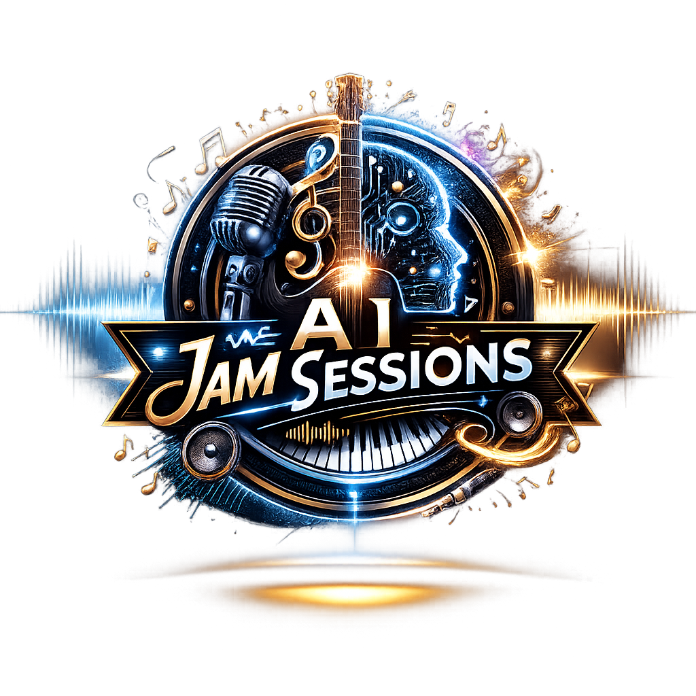

<p align="center">
  <a href="README.md">English</a> | <strong>日本語</strong> | <a href="README.zh.md">中文</a> | <a href="README.es.md">Español</a> | <a href="README.fr.md">Français</a> | <a href="README.hi.md">हिन्दी</a> | <a href="README.it.md">Italiano</a> | <a href="README.pt-BR.md">Português</a>
</p>

<p align="center">
  
</p>

<p align="center">
  <em>昔ながらの方法で機械学習</em>
</p>

<p align="center">
  AIにピアノの弾き方と歌い方を教えるMCPサーバー。<br/>
  12ジャンル120曲。5つのサウンドエンジン。ボーカルシンセサイザー搭載のブラウザコックピット。<br/>
  すべてを記憶する練習日記。
</p>

[](https://github.com/mcp-tool-shop-org/ai-jam-sessions/actions/workflows/ci.yml)
[](https://www.npmjs.com/package/@mcptoolshop/ai-jam-sessions)
[](https://github.com/mcp-tool-shop-org/ai-jam-sessions)
[](https://github.com/mcp-tool-shop-org/ai-jam-sessions)

---

## これは何？

AIが弾き方を学ぶピアノ。シンセサイザーでもMIDIライブラリでもなく、教育楽器です。

LLMはテキストを読み書きできますが、私たちのように音楽を体験することはできません。耳も指も筋肉の記憶もありません。AI Jam Sessionsは、モデルが実際に使える感覚を与えることでそのギャップを埋めます：

- **読む** — 深い音楽的アノテーション付きの本物のMIDI楽譜。手書きの近似ではなく、解析・分析・解説済み。
- **聴く** — 5つのオーディオエンジン（オシレーターピアノ、サンプルピアノ、ボーカルサンプル、物理声道モデル、加算合成ボーカル）がスピーカーで再生。部屋にいる人間がAIの耳になります。
- **見る** — 演奏内容をSVGとしてレンダリングするピアノロール。モデルが読み返して検証可能。ビジュアルキーボード、デュアルモードノートエディタ、チューニングラボを備えたブラウザコックピット。
- **記憶する** — セッションをまたいで保持される練習日記。学習が蓄積されます。
- **歌う** — オペラのソプラノから電子合唱まで20種類のボイスプリセットによる声道合成。ソルフェージュ、輪郭、音節ナレーション付きのシンガロングモード。

12ジャンルそれぞれに、歴史的背景、小節ごとの構造分析、重要な瞬間、教育目標、演奏ヒントを含む詳細なアノテーション付き模範曲があります。残りの96曲は未加工のMIDIで、AIがパターンを吸収し、音楽を演奏し、自分でアノテーションを書くのを待っています。

## ピアノロール

AIが音楽を見る方法です。どの曲もSVGとしてレンダリングします——右手は青、左手はコーラル、拍子グリッド、強弱記号、小節境界付き：

<p align="center">
  
</p>

<p align="center"><em>エリーゼのために、1–8小節 — 青のE5-D#5トリル、コーラルの低音伴奏</em></p>

2つのカラーモード：**手**（青/コーラル）または**ピッチクラス**（クロマチックレインボー — すべてのCは赤、すべてのF#はシアン）。SVG形式なのでモデルは画像を見ることも、マークアップを読んでピッチ、リズム、手の独立性を検証することもできます。

## コックピット

MCPサーバーと並行して開くブラウザベースの楽器・ボーカルスタジオ。プラグイン不要、DAW不要——ピアノのあるウェブページだけ。

- **デュアルモードピアノロール** — インストゥルメントモード（クロマチックピッチクラスカラー）とボーカルモード（母音形状 /a/ /e/ /i/ /o/ /u/ で色分け）を切替
- **ビジュアルキーボード** — C4から2オクターブ、QWERTYキーボードにマッピング。クリックまたはタイプ。
- **20種類のボイスプリセット** — Kokoroマッピング15種（Aoede、Heart、Jessica、Sky、Eric、Fenrir、Liam、Onyx、Alice、Emma、Isabella、George、Lewis、choir、synth-vox）、声道マッピング4種、合成合唱セクション
- **10種類のインストゥルメントプリセット** — サーバーサイドの6つのピアノボイス＋synth-pad、organ、bell、strings
- **ノートインスペクター** — ノートをクリックしてベロシティ、母音、ブレシネスを編集
- **7つの調律システム** — 平均律、純正律（長調/短調）、ピタゴラス、1/4コンマミーントーン、ヴェルクマイスターIII、カスタムセントオフセット。A4基準音調整可能（392–494 Hz）。
- **チューニング監査** — 周波数テーブル、うなり周波数分析付き音程テスター、チューニングのインポート/エクスポート
- **スコアのインポート/エクスポート** — スコア全体をJSONとしてシリアライズして読み戻し可能
- **LLM向けAPI** — `window.__cockpit`が`exportScore()`、`importScore()`、`addNote()`、`play()`、`stop()`、`panic()`、`setMode()`、`getScore()`を公開。LLMがプログラムで作曲・編曲・再生可能

## 学習ループ

```
 読む                演奏する             見る                振り返る
┌──────────┐     ┌───────────┐     ┌────────────┐     ┌──────────────┐
│ 模範曲の  │     │ 任意の速度 │     │ ピアノロール│     │ 学んだことを │
│ 分析を    │ ──▶ │ で曲を     │ ──▶ │ で検証     │ ──▶ │ 日記に記録   │
│ 学ぶ      │     │ 演奏する   │     │            │     │              │
└──────────┘     └───────────┘     └────────────┘     └──────┬───────┘
                                                             │
                                                             ▼
                                                    ┌──────────────┐
                                                    │ 次のセッション│
                                                    │ はここから再開│
                                                    └──────────────┘
```

## 曲ライブラリ

12ジャンル120曲、本物のMIDIファイルから構築。各ジャンルに歴史的背景、小節ごとの和声分析、重要な瞬間、教育目標、演奏ヒント（ボーカルガイダンス含む）を備えた詳細なアノテーション付き模範曲があります。これらの模範曲がテンプレートとなり、AIが1曲を学んで残りをアノテーションします。

| ジャンル | 模範曲 | キー | 学べること |
|---------|--------|------|-----------|
| ブルース | The Thrill Is Gone (B.B. King) | Bマイナー | マイナーブルース形式、コール＆レスポンス、ビハインドザビート |
| クラシック | エリーゼのために (ベートーヴェン) | Aマイナー | ロンド形式、タッチの差別化、ペダリングの規律 |
| 映画音楽 | Comptine d'un autre été (ティエルセン) | Eマイナー | アルペジオのテクスチャー、和声変化なしのダイナミクス構築 |
| フォーク | グリーンスリーブス | Eマイナー | 3/4ワルツ、モーダルミクスチャー、ルネサンス歌唱法 |
| ジャズ | 枯葉 (コスマ) | Gマイナー | ii-V-I進行、ガイドトーン、スウィング8分音符、ルートレスボイシング |
| ラテン | イパネマの娘 (ジョビン) | Fメジャー | ボサノバリズム、半音階的転調、ボーカルの抑制 |
| ニューエイジ | River Flows in You (ユリマ) | Aメジャー | I-V-vi-IV認識、流れるアルペジオ、ルバート |
| ポップ | イマジン (レノン) | Cメジャー | アルペジオ伴奏、抑制、ボーカルの誠実さ |
| ラグタイム | ジ・エンターテイナー (ジョプリン) | Cメジャー | ウンパベース、シンコペーション、複数ストレイン形式、テンポの規律 |
| R&B | 迷信 (スティーヴィー・ワンダー) | Ebマイナー | 16分音符ファンク、パーカッシブキーボード、ゴーストノート |
| ロック | ユア・ソング (エルトン・ジョン) | Ebメジャー | ピアノバラードのヴォイスリーディング、転回形、会話的な歌唱 |
| ソウル | リーン・オン・ミー (ビル・ウィザース) | Cメジャー | ダイアトニックメロディ、ゴスペル伴奏、コール＆レスポンス |

曲は**raw**（MIDIのみ）→ **annotated** → **ready**（音楽言語付きで完全に演奏可能）と進行します。AIは曲を学んで`annotate_song`でアノテーションを書いて昇格させます。

## サウンドエンジン

5つのエンジンと、任意の2つを同時に実行するレイヤードコンビネーター：

| エンジン | タイプ | サウンド |
|---------|--------|---------|
| **オシレーターピアノ** | 加算合成 | ハンマーノイズ、非調和性、48ボイスポリフォニー、ステレオイメージング付きマルチハーモニクスピアノ。依存関係ゼロ。 |
| **サンプルピアノ** | WAV再生 | Salamander Grand Piano — 480サンプル、16ベロシティレイヤー、88鍵。本物。 |
| **ボーカル（サンプル）** | ピッチシフトサンプル | ポルタメントとレガートモード付き持続母音トーン。 |
| **声道** | 物理モデル | Pink Trombone — LF声門波形、44セルデジタル導波管。4プリセット：ソプラノ、アルト、テノール、バス。 |
| **ボーカルシンセ** | 加算合成 | 15種のKokoroボイスプリセット。フォルマントシェーピング、ブレシネス、ビブラート。決定論的（シードRNG）。 |
| **レイヤード** | コンビネーター | 2つのエンジンをラップし全MIDIイベントを両方にディスパッチ — piano+synth、vocal+synthなど。 |

### キーボードボイス

6つの調整可能なピアノボイス。明るさ、減衰、ハンマー硬度、デチューン、ステレオ幅など各パラメーター調整可能：

| ボイス | 特徴 |
|-------|------|
| Concert Grand | 豊かで深い、クラシック向け |
| Upright | 暖かく親密、フォーク向け |
| Electric Piano | シルキー、ジャジー、Fender Rhodes風 |
| Honky-Tonk | デチューン、ラグタイム、サルーン |
| Music Box | 透明感、幻想的 |
| Bright Grand | 鮮明、現代的、ポップ向け |

## 練習日記

毎セッション後、サーバーが何が起きたかを記録します——どの曲か、速度、小節数、時間。AIが自分の振り返りを追加します：気づいたこと、認識したパターン、次に試すこと。

```markdown
---
### 14:32 — 枯葉
**jazz** | intermediate | Gマイナー | 69 BPM × 0.7 | 32/32小節 | 45秒

5-8小節のii-V-I (Cm7-F7-BbMaj7) はThe Thrill Is GoneのV-iと
同じ重力、ただしメジャーで解決。ブルースとジャズはジャンルの
ラベルが示す以上に共通点がある。

次回：フルスピードで試す。イパネマのブリッジ転調と比較する。
---
```

1日1つのマークダウンファイル、`~/.ai-jam-sessions/journal/`に保存。人間が読める形で、追記のみ。次のセッションでAIが日記を読んで前回の続きから再開します。

## インストール

```bash
npm install -g @mcptoolshop/ai-jam-sessions
```

**Node.js 18+**が必要。MIDIドライバー、仮想ポート、外部ソフトウェア不要。

### Claude Desktop / Claude Code

```json
{
  "mcpServers": {
    "ai_jam_sessions": {
      "command": "npx",
      "args": ["-y", "-p", "@mcptoolshop/ai-jam-sessions", "ai-jam-sessions-mcp"]
    }
  }
}
```

## MCPツール

4カテゴリー24ツール：

### 学ぶ

| ツール | 機能 |
|-------|------|
| `list_songs` | ジャンル、難易度、キーワードで検索 |
| `song_info` | 完全な音楽分析 — 構造、重要な瞬間、教育目標、スタイルヒント |
| `registry_stats` | ライブラリ全体の統計：総曲数、ジャンル、難易度 |
| `library_progress` | 全ジャンルのアノテーション状況 |
| `list_measures` | 全小節のノート、ダイナミクス、教育ノート |
| `teaching_note` | 1小節の詳細 — 運指、ダイナミクス、文脈 |
| `suggest_song` | ジャンル、難易度、演奏履歴に基づくレコメンデーション |
| `practice_setup` | 推奨速度、モード、ボイス設定、CLIコマンド |

### 演奏する

| ツール | 機能 |
|-------|------|
| `play_song` | スピーカーで再生 — ライブラリの曲または.midファイル。任意のエンジン、速度、モード、小節範囲 |
| `stop_playback` | 停止 |
| `pause_playback` | 一時停止・再開 |
| `set_speed` | 再生中に速度変更（0.1×–4.0×） |
| `playback_status` | リアルタイムスナップショット：現在の小節、テンポ、速度、キーボードボイス、状態 |
| `view_piano_roll` | SVGとしてレンダリング（手の色またはピッチクラスのクロマチックレインボー） |

### 歌う

| ツール | 機能 |
|-------|------|
| `sing_along` | 歌えるテキスト — 音名、ソルフェージュ、輪郭、音節。ピアノ伴奏あり/なし |
| `ai_jam_sessions` | ジャムブリーフ生成 — コード進行、メロディアウトライン、スタイルヒント |

### 構築する

| ツール | 機能 |
|-------|------|
| `add_song` | JSONとして新曲追加 |
| `import_midi` | .midファイルをメタデータ付きでインポート |
| `annotate_song` | 未加工の曲に音楽言語を書いてreadyに昇格 |
| `save_practice_note` | セッションデータ自動取得付き日記エントリ |
| `read_practice_journal` | 最近のエントリを読み込み |
| `list_keyboards` | 利用可能なキーボードボイス |
| `tune_keyboard` | キーボードボイスの各パラメーターを調整。セッション間で保持 |
| `get_keyboard_config` | 現在の設定 vs 工場出荷時デフォルト |
| `reset_keyboard` | キーボードボイスを工場出荷時にリセット |

## CLI

```
ai-jam-sessions list [--genre <genre>] [--difficulty <level>]
ai-jam-sessions play <song-id> [--speed <mult>] [--mode <mode>] [--engine <piano|vocal|tract|synth|guitar|piano+synth|guitar+synth>]
ai-jam-sessions sing <song-id> [--with-piano] [--engine <engine>]
ai-jam-sessions view <song-id> [--measures <start-end>] [--out <file.svg>]
ai-jam-sessions view-guitar <song-id> [--measures <start-end>] [--tuning <tuning>]
ai-jam-sessions info <song-id>
ai-jam-sessions stats
ai-jam-sessions library
ai-jam-sessions ports
```

## ステータス

v0.2.1。6つのサウンドエンジン、31のMCPツール、12ジャンル120曲（詳細なアノテーション付き模範曲）。20種のボーカルプリセット、10種のインストゥルメントボイス、7つの調律システム、LLM向けスコアAPIを備えたブラウザコックピット。2つのカラーモードのピアノロール。永続的な練習日記。MIDIはすべて揃っています——ライブラリはAIの学習とともに成長します。

## ライセンス

MIT
