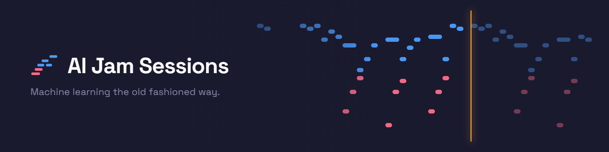
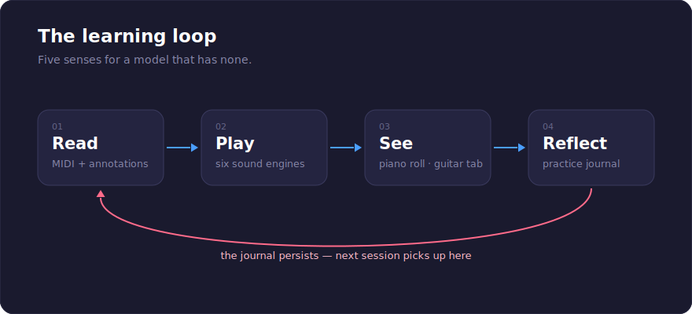

<p align="center">
  <a href="README.md">English</a> | <a href="README.zh.md">中文</a> | <a href="README.es.md">Español</a> | <a href="README.fr.md">Français</a> | <a href="README.hi.md">हिन्दी</a> | <a href="README.it.md">Italiano</a> | <a href="README.pt-BR.md">Português (BR)</a>
</p>

<p align="center">
  
</p>

<p align="center">
  <em>Machine Learning the Old Fashioned Way</em>
</p>

<p align="center">
  An MCP server that teaches AI to play piano and guitar — and sing.<br/>
  120 songs across 12 genres. Six sound engines. Interactive guitar tablature.<br/>
  A browser cockpit with vocal synthesizer. A practice journal that remembers everything.
</p>

<p align="center">
  <a href="https://github.com/mcp-tool-shop-org/ai-jam-sessions/actions/workflows/ci.yml"></a>
  <a href="https://www.npmjs.com/package/@mcptoolshop/ai-jam-sessions"></a>
  <a href="https://github.com/mcp-tool-shop-org/ai-jam-sessions"></a>
  <a href="https://github.com/mcp-tool-shop-org/ai-jam-sessions"></a>
  <a href="datasets/jam-actions-v0-public/README.md"></a>
  <a href="https://doi.org/10.5281/zenodo.20279919"></a>
</p>

---

## これは何ですか？

AIが演奏を学習するピアノとギター。シンセサイザーでも、MIDIライブラリでもありません。あくまで教育用の楽器です。

LLMはテキストを読み書きできますが、私たちが体験するように音楽を体験することはできません。耳もなければ、指もなければ、筋肉の記憶もありません。AI Jam Sessionsは、モデルが実際に使用できる感覚を与えることで、このギャップを埋めます。

- **読解** — 詳細な音楽注釈が付いた実際のMIDI楽譜。手書きの近似ではなく、解析され、分析され、説明されています。
- **聴覚** — 6つのオーディオエンジン（オシレーターピアノ、サンプルピアノ、ボーカルサンプル、物理的な声帯モデル、加算型ボーカルシンセ、物理モデリングギター）。これらがスピーカーから再生されるため、部屋にいる人々がAIの耳になります。
- **視覚** — ピアノロールは、演奏された内容をSVG形式でレンダリングし、モデルが読み込んで検証できるようにします。インタラクティブなギタータブ譜エディター。視覚的なキーボード、デュアルモードノートエディター、チューニングラボを備えたブラウザの操作パネル。
- **記憶** — 複数のセッションにわたって保持される練習ジャーナルにより、時間の経過とともに学習が蓄積されます。
- **歌唱** — オペラソプラノから電子合唱まで、20種類の音声プリセットを備えた声帯合成。ソフィー、音階、および音節のナレーションを使用した一緒に歌うモード。

120曲すべてに、歴史的背景、小節ごとの構造分析、重要なポイント、教育目標、パフォーマンスのヒントなど、詳細な注釈が加えられています（すべての12ジャンル）。このREADMEの以前のバージョンでは、生の楽曲は「AIがパターンを吸収し、音楽を演奏し、独自の注釈を作成するのを待っている」と記載されていました。まさにそれが起こったのです。注釈は、決定論的な曲ごとの分析（コード、反復構造、セクション境界、コンテンツ検証されたキー）に基づいてAIによって作成され、品質基準によって制御され、個々の主張が対立的に事実確認されました（小節番号、コードウィンドウ、および構造カウントはすべて実際のMIDIに対して検証されています）。

この作業から派生して、**[jam-actions-v0](#training-dataset)**も公開します。これは、実際のクラシックピアノ音楽を使用した115回の多段階のMCPツール使用履歴のパブリックデータセットです。LLMに、単なるテキスト生成ではなく、「シンボリック音楽における具体的なツール使用」を学習させます。また、7軸のリリースゲートが付属しており、「証拠を伝える」ことと「タスクが些細な理由で合格する」ことを区別します。詳細については、以下の[トレーニングデータセット](#training-dataset)を参照してください。

## ピアノロール

ピアノロールは、AIが音楽をどのように認識するかを示しています。任意の曲をSVG形式でレンダリングし、右手を青色、左手をコーラル色で表示し、拍のグリッド、ダイナミクス、小節の境界線を追加します。

<p align="center">
  
</p>

<p align="center"><em>Für Elise, measures 1–8 — the E5-D#5 trill in blue, bass accompaniment in coral</em></p>

2つのカラーモード：**手**（青/コーラル）または**音級**（クロマティックレインボー — すべてのCは赤色、すべてのF#はシアン）。SVG形式であるため、モデルは画像を視覚的に確認できるだけでなく、マークアップを読み込んでピッチ、リズム、および手の独立性を検証することもできます。

## 操作パネル

このリポジトリの[`apps/cockpit`](apps/cockpit)にあるブラウザベースの作曲スタジオであり、**[mcp-tool-shop-org.github.io/ai-jam-sessions/cockpit](https://mcp-tool-shop-org.github.io/ai-jam-sessions/cockpit/)**でライブ実行されます。プラグインもDAWもインストールも不要です。すべてがブラウザ内に保存され（作業内容はローカルに自動保存されます）。ハッキングしたいですか？

```bash
cd apps/cockpit && npm install && npm run dev   # Vite dev server, opens in your browser
```

- **正確なテンポ制御** — 音符は音楽的な時間軸上に存在するため、BPMコントロールは実際に再生時間を調整します。クリックしてシークできるタイムルーラーと、ドラッグして設定できる**ループ領域**。プレイヘッドを追跡する自動スクロール機能。
- **録音アームキャプチャ** — QWERTYキー、画面上のキーボード、またはWeb MIDIデバイスを使用して演奏すると、スコアに記録されます。1小節のカウントイン、ループサイクル全体でのルーピングスタイルのオーバーダビング（または置換モード）、生のパフォーマンスタイミングが量子化されたビューの下に保存され、各パスは元に戻せる単位になります。
- **完全なアンドゥ/リドゥ** — ClearやImportを含むすべての編集操作を元に戻すことができます（Ctrl+Z）。ドラッグジェスチャーは、実際のエディターと同様の方法で統合されます。
- **複数選択 + クリップボード** — Select/Drawツールを切り替えて、領域を選択し、プラットフォーム標準の修飾キーを使用し、プレイヘッド上でコピー/カット/ペーストを実行し、複製します。
- **タッチ + アクセシビリティ** — すべてのサーフェスでキャプチャされたポインターイベント、ドラッグ操作の代替としてタップして再配置、キーボードでのノート編集、色覚異常でも識別しやすいスコアオーバーレイ。
- **デュアルモードピアノロール** — インストルメントモード（クロマティック音級カラー）とボーカルモード（母音の形によって着色された音符：/a/ /e/ /i/ /o/ /u/）を切り替えます。
- **視覚的なキーボード** — C4から2オクターブ、QWERTYキーにマッピングされています。クリックまたは入力します。
- **20種類の音声プリセット** — 15種類のKokoroマップされた音声（Aoede、Heart、Jessica、Sky、Eric、Fenrir、Liam、Onyx、Alice、Emma、Isabella、George、Lewis、および合唱とシンセボイス）、4つのトラクトマップされた音声、および合成合唱セクション。
- **10種類の楽器プリセット** — サーバー側の6つのピアノ音声に加えて、シンセパッド、オルガン、ベル、ストリングス。
- **ノートインスペクター** — 任意の音符をクリックして、ベロシティ、母音、および息の強さを編集します。
- **7種類のチューニングシステム** — 平均律、純正調（長調/短調）、ピタゴラス音階、四分音差平均律、ヴェルクマイスターIII、またはカスタムセントオフセット。調整可能なA4基準（392〜494 Hz）。
- **チューニング監査** — 周波数テーブル、ビート周波数分析を備えたインターバルトエスタ、およびチューニングのエクスポート/インポート。
- **スコアのインポート/エクスポート** — スコア全体をJSONとしてシリアライズし、ロードします。
- **LLM対応API** — `window.__cockpit`は、`exportScore()`、`importScore()`、`addNote()`、`play()`、`stop()`、`panic()`、`setMode()`、および`getScore()`を公開するため、LLMがプログラムで作曲、編曲、および再生を実行できます。

## 学習ループ

<p align="center">
  
</p>

## 楽曲ライブラリ

実際のMIDIファイルから作成された12ジャンルにわたる120曲。各ジャンルには、歴史的背景、小節ごとの調和分析、重要なポイント、教育目標、およびパフォーマンスのヒント（ボーカルガイダンスを含む）を備えた、詳細な注釈が加えられた模範的な楽曲があります。これらの模範的な楽曲はテンプレートとして機能します。AIはまず1つを学習し、次に残りの楽曲に注釈を付けます。

| ジャンル | 模範 | 要点、重要な点。 | 何を教えているのか。 |
|-------|----------|-----|-----------------|
| ブルース | スリルは消え去った（Ｂ．Ｂ．キング） | ロ短調 | シンプルなブルース形式、コール＆レスポンス、ビートのわずかな遅れを意識した演奏。 |
| 古典的な。 | エリーゼのために（ベートーヴェン） | 軽微な、わずかな。 | ロンド形式、タッチの使い分け、ペダリングの正確性 |
| 映画 | もう一つの夏の調べ（ティエルセン） | ホ短調 | アルペジオによるテクスチャー、調性変化のないダイナミックなアーキテクチャ。 |
| 民俗、民話、大衆音楽 | グリーンスリーブス | ホ短調 | 4分の3拍子のワルツのリズム、旋法の混合、ルネサンス時代の声楽曲スタイル。 |
| ジャズ | 紅葉（コスマ） | ト短調 | II-V-Iのコード進行、ガイドトーン、スウィングのリズム、ルートを持たないボイシング |
| ラテン語 | イパネマの娘（ジョビン） | ヘ長調 | ボサノヴァのリズム、半音階的な転調、抑制された歌い方。 |
| ニューエイジ | 「リバー・フローズ・イン・ユー」（イルマ） | 主要な | Ⅰ－Ⅴ－Ⅵ－Ⅳのコード進行、流れるようなアルペジオ、ルバート |
| ポップ（音楽） | 「イマジン」（ジョン・レノン） | ハ長調 | アルペジオによる伴奏、抑制された表現、歌声の真摯さ。 |
| ラグタイム | 「ザ・エンターテイナー」（ジョプリン） | ハ長調 | お祭り騒ぎのような重低音、シンコペーション、複数のセクションから構成される形式、一定のリズムを保つこと。 |
| リズム・アンド・ブルース | 迷信（スティーヴィー・ワンダー） | ホ短調 | 16分音符のファンク、パーカッシブなキーボード、ゴーストノート |
| ロック | 「あなたの歌」（エルトン・ジョン） | ホ長調 | ピアノのバラードにおける声部の動き、転回形、会話のような歌い方。 |
| 魂。 | 「私に寄りかかって」（ビル・ウィザース） | ハ長調 | ダイアトニック旋律、ゴスペル風の伴奏、コール・アンド・レスポンス |

楽曲は、まず**未加工の段階**（MIDIのみ）から始まり、次に**注釈が加えられ**、最後に**完成され**（音楽的な表現をすべて備えた状態で再生可能になります）。AIは、楽曲を分析し、`annotate_song`を使って注釈を作成することで、楽曲の改善に貢献します。

## サウンドエンジン

6つのエンジンに加え、任意の2つを同時に動作させることができる多層式コンバイネーターを備えています。

| エンジン | 種類 | どんな音に聞こえるか。 |
|--------|------|---------------------|
| **Oscillator Piano** | 加算合成 | ハンマーの打鍵音、非調和性、48声部のポリフォニー、ステレオによる音像再現機能を備えた多重ハーモニックピアノ。依存関係は一切なし。 |
| **Sample Piano** | WAVファイルの再生 | サラマンダー・グランドピアノ：480のサンプル、16段階のベロシティレイヤー、88鍵。本物の音を再現。*プログラムによるAPIのみ対応：サンプルは同梱されていません（[Salamander](https://freepats.zenvoid.org/Piano/acoustic-grand-piano.html)のダウンロードをご自身でお願いします）。CLI/MCPエンジンへの統合はまだ実装されていません。* |
| **Vocal (Sample)** | ピッチを変えたサンプル音源 | 滑らかな音のつながり（ポートメント）と、なめらかに音を続ける奏法（レガート）を用いた持続的な母音。 |
| **Vocal Tract** | 物理モデル | ピンク・トロンボーン：44個のセルを持つデジタル導波管を通して、LF（低周波）の声門波形を再現。プリセットは4種類：ソプラノ、アルト、テノール、バス。 |
| **Vocal Synth** | 加算合成 | 15種類の「ココロ」ボイスプリセットを搭載。フォルマント調整、息の強さ、ビブラートなどの機能を備えています。決定的な（シード値に基づいた）乱数生成を使用しています。 |
| **Guitar** | 加算合成 | 物理モデリングによる弦楽器音源。プリセットは以下の4種類（スチール・ドレッドノート、ナイロン・クラシック、ジャズ・アーチトップ、12弦ギター）、チューニングは8種類、調整可能なパラメーターは17種類。 |
| **Layered** | コンビネーター | 2つのエンジンをまとめて扱い、すべてのMIDIイベントを両方に送信します。例えば、ピアノとシンセサイザー、ボーカルとシンセサイザーなどです。 |

### キーボードの音色

6種類の調整可能なピアノ音色を搭載。各音色は、明るさ、減衰、ハンマーの硬さ、ピッチのずれ、ステレオ幅など、個別のパラメーターで調整可能：

| 声、発言する | キャラクター。 |
|-------|-----------|
| コンサート・グランドピアノ | 豊かで、重厚で、古典的な |
| まっすぐな、正直な。 | 温かく、親密で、フォーク調の。 |
| 電子ピアノ | 滑らかで、ジャジーな、フェンダー・ローズのような音色。 |
| ホンキー・トンク | 音程がずれている、ラグタイム、酒場 |
| オルゴール | 結晶のような、幽玄な |
| 明るいグランド | 洗練された、現代的な、ポップな |

### ギターの音色

物理モデリングによる弦の合成を再現した、4種類のギターボイスプリセット。それぞれに17個の調整可能なパラメーター（明るさ、ボディの共鳴、ピッキング位置、弦の減衰など）が搭載されています。

| 声、発言する | キャラクター。 |
|-------|-----------|
| 鋼鉄のドレッドノート艦 | 明るく、バランスが良く、クラシックな音色のもの。 |
| ナイロン製 クラシックギター弦 | 暖かく、柔らかく、丸みを帯びた |
| ジャズ・アーチトップ | まろやかで、木の香りがして、清潔感がある。 |
| 12弦 | きらめき、二重になったような、合唱のような。 |

## 練習日誌

セッションが終了するたびに、サーバーはそこで何が起こったかを記録します。具体的には、どの曲が演奏されたか、速度はどれくらいだったか、小節数はいくつだったか、演奏時間はどれくらいだったかなどです。そして、AIはそれらの情報に基づいて独自の分析を加えます。例えば、どのような点に気づいたか、どのようなパターンを認識したか、次に何を試すべきかなどを検討します。

```markdown
---
### 14:32 — Autumn Leaves
**jazz** | intermediate | G minor | 69 BPM × 0.7 | 32/32 measures | 45s

The ii-V-I in bars 5-8 (Cm7-F7-BbMaj7) is the same gravity as the V-i
in The Thrill Is Gone, just in major. Blues and jazz share more than the
genre labels suggest.

Next: try at full speed. Compare the Ipanema bridge modulation with this.
---
```

1日に1つのマークダウン形式のファイルを、`~/.ai-jam-sessions/journal/` ディレクトリに保存します。内容は人間が読みやすく、追記のみ可能です。次のセッションでは、AIがこのファイルの内容を読み込み、中断したところから作業を再開します。

## 学習データセット

**jam-actions-v0** ― これは、実際のクラシックピアノのMIDIデータに基づいて作成された、複数回のやり取りを含むMCPツール使用履歴をまとめた公開データセットです。このサーバーで使用されているライブラリと同じものを使用して構築されており、このデータセットはLLMに、単なるテキスト生成ではなく、**シンボル化された音楽における具体的なツールの使用方法**を学習させます。

各レコードは、4小節のフレーズウィンドウと、注釈付きの教育目標、および「ターゲットトレース」をペアにします。「ターゲットトレース」とは、アシスタントが上記のMCPツール（`get_events_in_measure`、`get_events_in_hand`、`count_distinct_pitch_classes`、およびその他の9つのMIDIインスペクターツールのセット）を使用して、フレーズを読み、分析し、議論する一連のセッションです。

| | |
|---|---|
| **DOI** | [**`10.5281/zenodo.20279919`**](https://doi.org/10.5281/zenodo.20279919) — Zenodo、2026年5月19日公開 |
| レコード | 115（公開サブセット） |
| 標準ベースライン | 修正後のE3、16レコード |
| 楽曲 | 6人の作曲家による8つのクラシックピアノ作品（バッハ、ベートーヴェン、ショパン、ドビュッシー、モーツァルト、シューマン） |
| MIDIソース | piano-midi.de — ベント・クルーガー編曲 |
| ライセンス | CC-BY-SA-3.0-DE（編曲）、パブリックドメインの楽曲 |
| バージョン | 0.4.3 (2026-05-19) |
| スキーマ | `release-gate-assessment/2.0.0` |

**品質に関する説明 — 7軸リリースゲート。** このデータセットには、証拠に基づいた合格と、上限に達した合格を区別するリリースゲートが含まれています。軸1〜6はブロック（絶対的な下限、マージン複合、ツール使用率、ツール後の修正、誤解の数、層の下限）であり、軸7は強化されたレポートと非レポートです。軸2と6では、`ceiling_saturated_pass`バケットが許可されるため、テキストのみ/ツールによる検査/ランダムMIDI条件で1.000を獲得したレコードは、より難しい層を希釈しません。スライス22のベースラインは、改訂されたゲートに**合格します**。スライス19のベースラインはまだ**不合格です** — ゲートが機能するように、回帰診断として保持されます。

**再現性。** どのプラットフォーム（Windowsネイティブ、macOS、Linux、WSL）でも、新しいコントリビューターはパッケージを検証し、1分以内に標準のPASS結果を再現できます。

```bash
git clone https://github.com/mcp-tool-shop-org/ai-jam-sessions.git
cd ai-jam-sessions && pnpm install
pnpm exec tsx scripts/verify-public-package-checksums.ts        # 274 entries, ~2s
pnpm exec tsx scripts/check-release-gate.ts \
  datasets/jam-actions-v0-public/evals/slice21-fair-e3-baseline-results.json
# → "Aggregate: PASS" (exit 0)
```

`.gitattributes`は、`*.sha256`とパブリックデータセットツリーに対してLF行末を設定するため、チェックサム検証ツールはすべてのプラットフォームで機能します。リリースゲートCLIは厳密な位置指定（不明または複数の位置引数を拒否）であるため、初めて参加するコントリビューターが誤って実行することはありません。

**入手先。** 公開されたZenodoレコードはhttps://zenodo.org/records/20279919にあります（DOI：[`10.5281/zenodo.20279919`](https://doi.org/10.5281/zenodo.20279919)）、データセットはHugging Faceの[`mcp-tool-shop/jam-actions-v0`](https://huggingface.co/datasets/mcp-tool-shop/jam-actions-v0)にミラーリングされており、`load_dataset()`を使用するユーザーが利用できます。完全なデータセットカードは[`datasets/jam-actions-v0-public/README.md`](datasets/jam-actions-v0-public/README.md)にあります。Zenodoのメタデータは[`zenodo-metadata.json`](datasets/jam-actions-v0-public/zenodo-metadata.json)、引用メタデータは[`CITATION.cff`](datasets/jam-actions-v0-public/CITATION.cff)、公開レシートは[`publication-receipt.json`](datasets/jam-actions-v0-public/publication-receipt.json)、リリースノートは[`RELEASE_NOTES.md`](datasets/jam-actions-v0-public/RELEASE_NOTES.md)にあります。初期のコーパスドラフトから、オフバイワンの修正、シューマンの改善、RCゲートの改訂、オペレーター単独での監査、および公開実行までの25スライスのビルドシーケンスは、[`docs/`](docs/)にあります。

**引用方法。** `mcp-tool-shop-org & Krueger, B. (2026). AI Jam Sessions — Tool-Use Traces v0 (Public Subset). Zenodo. https://doi.org/10.5281/zenodo.20279919`

**HuggingFaceミラー。** v1.4.xパッチで公開 — 詳細は[`datasets/jam-actions-v0-public/publication-receipt.json`](datasets/jam-actions-v0-public/publication-receipt.json)の保留ステータスブロックを参照してください。Zenodo DOIが標準の引用ハンドルであり、HFミラーはMLエコシステムでの発見のみを目的としています。

> MIDI編曲はベント・クルーガー（piano-midi.de）によるもので、CC-BY-SA-3.0-DEライセンスです。注釈、トレース、および評価アーティファクトはAI Jam Sessionsチームによって作成され、同じライセンスで公開されるため、シェアアライクライクチェーンが最初から最後まで維持されます。**ライセンス境界：**リポジトリのMITライセンスはコードを対象とし、`datasets/`の下にあるものはすべてCC-BY-SA-3.0-DEです。`datasets/jam-actions-v0/`にある作業コーパスには、さらに2つの作品（サティのジムノペディ第1番、ドビュッシーのアラベスク第1番）が含まれており、これらの編曲の出所を確認できなかったため、公開サブセットから除外されています — 詳細は[`datasets/jam-actions-v0/PROVENANCE-NOTE.md`](datasets/jam-actions-v0/PROVENANCE-NOTE.md)を参照してください。

## インストール

```bash
npm install -g @mcptoolshop/ai-jam-sessions
```

**Node.js 18以上**が必要です。MIDIドライバ、仮想ポート、外部ソフトウェアは必要ありません。

### Claude Desktop / Claude Code

```json
{
  "mcpServers": {
    "ai_jam_sessions": {
      "command": "npx",
      "args": ["-y", "-p", "@mcptoolshop/ai-jam-sessions", "ai-jam-sessions-mcp"]
    }
  }
}
```

## MCPツール

7つのカテゴリにわたる46のツールと3つのプロンプトテンプレート：

### 学習

| ツール | 機能 |
|------|--------------|
| `list_songs` | ジャンル、難易度、またはキーワードで検索 |
| `song_info` | 完全な音楽分析 — 構造、重要な部分、教育目標、スタイルのヒント |
| `registry_stats` | ライブラリ全体の統計：合計曲数、ジャンル、難易度 |
| `list_measures` | 各小節の音符、ダイナミクス、および教育ノート |
| `teaching_note` | 単一の小節の詳細 — 指づけ、ダイナミクス、コンテキスト |
| `suggest_song` | ジャンル、難易度、および再生履歴に基づく推奨 |
| `practice_setup` | 曲の推奨速度、モード、ボイス設定、およびCLIコマンド |
| `compare_songs` | クロスジャンルのパターン認識 — 主要な関係、ピッチ/インターバルの類似性、共有された形式、教育上のつながり |
| `annotation_progress` | ライブラリ全体の注釈品質を追跡 — スコア、評価、改善の提案 |
| `server_info` | サーバーバージョン、ライブラリストアティスティクス、エンジンリスト、アクティブなセッション |

### 再生

| ツール | 機能 |
|------|--------------|
| `play_song` | スピーカーから再生 — ライブラリの曲または生の .mid ファイル。4つのエンジン（ピアノ、ボーカル、トラック、ギター）、任意の速度、モード、小節範囲 — さらにカウントイン付きのメトロノームと、セッションを録音して採点するための `record` フラグ。シンセサイザーとレイヤードエンジンはCLI専用です。 |
| `stop_playback` | 停止 |
| `pause_playback` | 一時停止または再開 |
| `set_speed` | 再生中に速度を変更（0.1倍速～4.0倍速） |
| `playback_status` | リアルタイムスナップショット：現在の小節、テンポ、速度、キーボードの音色、状態 |
| `view_piano_roll` | SVG形式でレンダリング（手の色の指定またはピッチクラスによるクロマティックな虹色） |
| `score_performance` | MIDI伴奏に合わせて演奏を採点 — ピッチの正確さ、タイミング、完成度を評価し、段階的なフィードバックを提供 |
| `mute_hand` | 練習中に左手/右手の音をミュートまたはミュート解除 — 一度に片方の手を分離して練習 |
| `detect_chord` | 現在鳴っているMIDIノートのセットからコード名を特定（例：`[60,64,67]` → C） |
| `preview_teaching_cues` | 演奏前に、すべてのティーチングノートと重要なポイントを確認 |

### 練習

| ツール | 機能 |
|------|--------------|
| `practice_loop` | 実際の教師が割り当てる練習：5～8小節を遅いテンポで繰り返し再生し、*完璧に*演奏できた場合にのみテンポを上げ（+5%） — 各試行は録音、採点、要約されます。 |
| `practice_status` | 現在の練習の進捗状況：現在の試行回数、速度、および最後の試行における小節ごとの診断結果 |
| `score_last_take` | 最近録音された演奏を採点 — ピッチの正確さ、タイミング、完成度、ノートごとの評価 |
| `view_scored_piano_roll` | すべての教師が使用する採点譜：ピアノロールに、色覚異常でも識別しやすいパレットでノートごとの評価結果（実線＝正解、破線＝タイミング、✕＝ミス）を重ねて表示 |

### 歌う

| ツール | 機能 |
|------|--------------|
| `sing_along` | 歌えるテキスト — 音名、ソルフージュ、音程の動き、または歌詞。ピアノ伴奏付きまたはなし。 |
| `ai_jam_sessions` | 即興演奏のための概要を生成 — コード進行、メロディーの輪郭、および再解釈のためのスタイルヒント |

### ギター

| ツール | 機能 |
|------|--------------|
| `view_guitar_tab` | インタラクティブなギタータブ譜をHTMLとしてレンダリング — クリックして編集、再生カーソル、キーボードショートカット |
| `list_guitar_voices` | 利用可能なギターの音色プリセット |
| `list_guitar_tunings` | 利用可能なギターのチューニングシステム（標準、ドロップD、オープンG、DADGADなど） |
| `tune_guitar` | 任意のギターの音色のパラメータを調整。セッション間で保持されます。 |
| `get_guitar_config` | 現在のギターの音色設定と工場出荷時のデフォルト値との比較 |
| `reset_guitar` | ギターの音色を工場出荷時の状態にリセット |

### ビルド

| ツール | 機能 |
|------|--------------|
| `add_song` | 新しい曲をJSON形式で追加 |
| `import_midi` | メタデータ付きの.midファイルをインポート |
| `annotate_song` | 生の曲の音楽言語を作成し、準備完了の状態に設定 |
| `save_practice_note` | 自動的にセッションデータをキャプチャしたジャーナルエントリ |
| `read_practice_journal` | 最近のエントリをロードしてコンテキストを表示 |
| `list_keyboards` | 利用可能なキーボードの音色 |
| `tune_keyboard` | 任意のキーボードの音色のパラメータを調整。セッション間で保持されます。 |
| `get_keyboard_config` | 現在の設定と工場出荷時のデフォルト値との比較 |
| `reset_keyboard` | キーボードの音色を工場出荷時の状態にリセット |
| `score_annotation` | 採点アノテーションの品質（5つの側面：完成度、深さ、具体性、教育的価値、語彙） |
| `validate_song_entry` | 曲を追加する前に、曲のJSONスキーマに対して検証を実行 |
| `transpose_song` | 曲を半音単位で上下に転調 — 新しいキー、新しいノート |
| `list_sections` | 曲の構造セクションを表示（イントロ、ヴァース、コーラスなど） |
| `add_section` | 曲にセクションマーカーを追加して、構造的なナビゲーションを可能にする |

### MCPプロンプト

構造化されたティーチングワークフローのための3つのプロンプトテンプレート：

| プロンプト | 機能 |
|--------|--------------|
| `annotate_song` | ガイド付きのアノテーションワークフロー — 模範を研究し、生の曲の音楽言語を作成する |
| `practice_plan` | ジャンル、難易度、および目標に基づいて、構造化された練習計画を作成 |
| `performance_review` | 完了したセッションを確認 — うまくいったこと、次に焦点を当てるべきこと |

## CLI

```
ai-jam-sessions list [--genre <genre>] [--difficulty <level>]
ai-jam-sessions play <song-id> [--speed <mult>] [--mode <mode>] [--engine <piano|vocal|tract|synth|guitar|piano+synth|guitar+synth>] [--metronome] [--count-in <bars>] [--record]
ai-jam-sessions practice <song-id> --measures <start-end> [--start-speed <pct>] [--target <pct>] [--step <pct>]
ai-jam-sessions sing <song-id> [--with-piano] [--engine <engine>]
ai-jam-sessions view <song-id> [--measures <start-end>] [--out <file.svg>]
ai-jam-sessions view-guitar <song-id> [--measures <start-end>] [--tuning <tuning>]
ai-jam-sessions info <song-id>
ai-jam-sessions tune <keyboard-id> [--param value ...] [--reset] [--show]
ai-jam-sessions tune-guitar <voice-id> [--param value ...] [--reset] [--show]
ai-jam-sessions keyboards
ai-jam-sessions guitars
ai-jam-sessions stats
ai-jam-sessions library
ai-jam-sessions ports
ai-jam-sessions help
ai-jam-sessions --version
```

## ステータス

v1.5.0 — ティーチング機能を学習したリリース（[CHANGELOG](CHANGELOG.md)を参照）。6つのサウンドエンジン、46のMCPツール、3つのプロンプトテンプレート、および**完全にアノテーションされたライブラリ：12のジャンルにわたる120曲中120曲**。すべての注釈は、曲ごとの分析と品質ゲートに基づいて作成されています。ティーチングループはエンドツーエンドで閉じられています：カウントイン付きのメトロノーム → ライブ録音 → ノートごとの採点 → 採点されたピアノロール譜 → 完璧に演奏できた場合にのみテンポを上げる練習ループ。ブラウザコックピットは、実際の作曲ツールになりました — ループ領域、録音アームキャプチャ、完全なアンドゥ/リドゥ、複数選択とクリップボード、タッチサポートを備えた正確なビートトラッキング — また、[ウェブ上で利用可能](https://mcp-tool-shop-org.github.io/ai-jam-sessions/cockpit/)です。曲の転調、セクションマーカー、片手ミュート/ソロ、インタラクティブなギタータブ譜、7つのチューニングシステム、練習ジャーナル、セッションの永続化。

また、**[jam-actions-v0](#training-dataset)** — クラシックピアノにおける複数回のMCPツールの使用履歴を記録した115件のトレーニングデータセットも公開します。7軸のリリースゲート、コールドスタート再現性、および完全なZenodo + CITATION.cffメタデータ（CC-BY-SA-3.0-DE） — また、[Hugging Face](https://huggingface.co/datasets/mcp-tool-shop/jam-actions-v0)にもミラーリングされています。MCPサーバー+コックピット+データセットパッケージャー+評価ハーネス+リリースゲートバリデーター全体で2506件のテストに合格しました。MIDIはすべて含まれており、すべての曲をティーチングに使用でき、その学習コーパスも一緒に提供されます。

## セキュリティとプライバシー

**アクセスされるデータ：** 曲ライブラリ（JSON + MIDI）、ユーザーの曲ディレクトリ（`~/.ai-jam-sessions/songs/`）、ギターチューニング設定、練習ジャーナルエントリ、ローカルオーディオ出力デバイス。

**アクセスされないデータ（デフォルトパス）：** MCPサーバーとCLIはネットワーク呼び出しを行わず、資格情報を読み取らず、ユーザーの曲ディレクトリ以外のシステムファイルにはアクセスしません。テレメトリーは収集または送信されません。パッケージに含まれる**オプトインのデータセット/評価ツール**（`scripts/run-llm-eval.ts`、プロビナンス検証ツール）が唯一の例外です。明示的に呼び出した場合、LLM APIを呼び出すことができ（環境変数から`ANTHROPIC_API_KEY`を読み取り、保存することはありません）、プロビナンスURLを取得します。サーバー、CLI、またはインストールの一部として実行されることはありません。

**権限：**MCPサーバーはstdioトランスポートのみを使用します（HTTPは使用しません）。CLIはローカルファイルシステムとオーディオデバイスにアクセスします。完全なポリシーについては、[SECURITY.md](SECURITY.md)を参照してください。

## ライセンス

MIT
