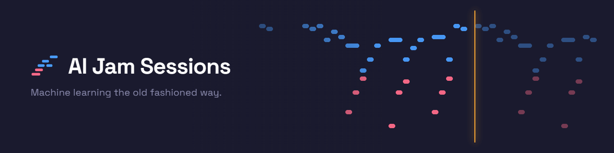

<p align="center">
  <a href="README.ja.md">日本語</a> | <a href="README.zh.md">中文</a> | <a href="README.es.md">Español</a> | <a href="README.fr.md">Français</a> | <a href="README.hi.md">हिन्दी</a> | <a href="README.it.md">Italiano</a> | <a href="README.md">English</a>
</p>

<p align="center">
  
</p>

<p align="center">
  <em>Machine Learning the Old Fashioned Way</em>
</p>

<p align="center">
  An MCP server that teaches AI to play piano and guitar — and sing.<br/>
  108 annotated songs across 12 genres. Six sound engines. Interactive guitar tablature.<br/>
  A browser cockpit with vocal synthesizer. A practice journal that remembers everything.
</p>

<p align="center">
  <a href="https://github.com/mcp-tool-shop-org/ai-jam-sessions/actions/workflows/ci.yml"></a>
  <a href="https://www.npmjs.com/package/@mcptoolshop/ai-jam-sessions"></a>
  <a href="https://github.com/mcp-tool-shop-org/ai-jam-sessions"></a>
  <a href="https://github.com/mcp-tool-shop-org/ai-jam-sessions"></a>
  <a href="datasets/jam-actions-v0-public/README.md"></a>
  <a href="https://doi.org/10.5281/zenodo.20279918"></a>
</p>

---

## O que é isto?

Um piano e uma guitarra que a IA aprende a tocar. Não é um sintetizador, nem uma biblioteca MIDI — é um instrumento de ensino.

Um LLM pode ler e escrever texto, mas não consegue vivenciar a música da mesma forma que nós. Sem ouvidos, sem dedos, sem memória muscular. O AI Jam Sessions preenche essa lacuna, fornecendo ao modelo sentidos que ele pode realmente usar:

- **Leitura** — partituras MIDI reais com anotações musicais detalhadas. Não são aproximações manuscritas — são analisadas, interpretadas e explicadas.
- **Audição** — seis motores de áudio (piano oscilador, piano de amostra, amostras vocais, trato vocal físico, sintetizador vocal aditivo, guitarra modelada fisicamente) que reproduzem o som através dos seus alto-falantes, transformando os ouvintes em ouvidos da IA. E agora o modelo tem os seus próprios ouvidos, em dobro: pode medir uma gravação após o fato (veja [Ouvir](#ouvir)) e pode observar a banda **enquanto a música ainda está a tocar** (veja [O Conjunto ao Vivo](#o-conjunto-ao-vivo)).
- **Visualização** — um piano roll que renderiza o que foi tocado como SVG, permitindo que o modelo o releia e verifique. Um editor interativo de tablaturas de guitarra. Um painel de controle com um teclado visual, editor de notas de modo duplo e laboratório de afinação.
- **Memorização** — um diário de prática que persiste entre as sessões, para que o aprendizado se acumule com o tempo.
- **Canto** — síntese do trato vocal com 20 predefinições de voz, desde soprano operístico até coral eletrônico. Modo de acompanhamento com solfejo, contorno e narração de sílabas. E uma linha melódica cantada real no ritmo do piano: um cantor condicionado pela partitura, impulsionado pelo MIDI da música, com limitação de tempo (40 ms) e afinação (50 centavos) antes que você a ouça — veja [Cantar](#cantar).

Cada uma das 108 músicas está agora totalmente anotada — contexto histórico, análise estrutural barra a barra, momentos-chave, objetivos de ensino e dicas de desempenho, em todos os 12 gêneros. Uma versão anterior deste arquivo README dizia que as músicas originais estavam "aguardando que a IA absorvesse os padrões, tocasse a música e escrevesse suas próprias anotações". É exatamente isso que aconteceu: as anotações foram escritas pela IA com base em uma análise determinística por música (acordes, estrutura de repetição, limites de seção, tonalidades verificadas pelo conteúdo), com base em uma rubrica de qualidade e verificadas de forma adversária, afirmação por afirmação — números de compasso, janelas de acordes e contagens estruturais, tudo verificado em relação ao MIDI real antes de qualquer lançamento.

A partir deste mesmo trabalho, também publicamos **[jam-actions-v0](#training-dataset)** — um conjunto de dados público de 57 rastreamentos de uso de ferramentas MCP em várias etapas, em relação a peças de piano clássico reais. Ele ensina aos LLMs a realizar *o uso de ferramentas fundamentado em música simbólica*, e não apenas a geração de texto, e vem com um portão de lançamento de 7 eixos que distingue "transmitir evidências" de "transmitir porque a tarefa é trivial". Consulte [Conjunto de dados de treinamento](#training-dataset) abaixo para obter a história completa.

## Ouvir

Por muito tempo, este servidor podia gerar som, mas nunca analisá-lo. O modelo tocava, uma pessoa
ouvia e o modelo aceitava a opinião dessa pessoa. Essa lacuna agora foi preenchida.

Aponte-o para um arquivo WAV e ele medirá o que está presente. Não analisando uma imagem e
adivinhando, mas processando o sinal através das mesmas ferramentas que já usa na partitura:

- **`analyze_audio`** — início, contorno da altura e nível. A altura é retornada como nomes de notas com
desvios em centésimos, nunca como frequências brutas.
- **`transcribe_audio`** — a gravação como notas: altura, início, duração e a distância de cada nota em relação à
altura de referência.
- **`score_audio_take`** — avalia uma performance em relação a uma música na biblioteca **de ouvido**. Ele
transcreve a gravação, compara-a com a partitura e informa quais notas foram tocadas corretamente,
quais foram ligeiramente diferentes e quais foram omitidas. Em seguida, `view_scored_piano_roll` desenha o resultado
sobre a partitura, exatamente como faz com uma gravação MIDI. É assim que você avalia um
instrumento real, uma gravação vocal ou qualquer coisa em que não haja MIDI para capturar.
- **`view_spectrogram`** — visualize o som. Um espectrograma de Q constante com um teclado de piano na borda
esquerda, para que a altura seja legível rapidamente, e as notas pretendidas da música sejam
desenhadas sobre ele, quando solicitado.

**O que ele não lhe dirá.** A imagem serve para identificar *onde* algo está errado; cada número
provém do processamento de sinal, nunca da leitura de uma imagem por um modelo. O transcriptor
segue uma linha de cada vez, portanto, um acorde ou uma mixagem completa produzirão algo
confiante, mas incorreto, e ele o indicará. A detecção de início opera em torno de F1 0,88 no
estado da arte, portanto, uma nota "omitida" pode ser uma que o transcriptor não conseguiu ouvir,
e não uma que você não tocou — as ferramentas carregam essa ressalva em sua própria saída, em vez
de escondê-la aqui.

Toda a estrutura é independente: a transformação, o rastreador de altura, o detector de início, o
decodificador WAV e o codificador PNG estão todos neste repositório e produzem números idênticos
no Node e no navegador.

## O Conjunto ao Vivo

A avaliação da audição analisa uma gravação após o seu término. Esta é a outra metade: perguntar o que cada
instrumento está a fazer **neste exato momento**, durante a apresentação.

```
ensemble_now()
```

Ele responde com as notas sustentadas de cada instrumento, o tempo que cada uma foi sustentada e o acorde combinado
em todo o conjunto. Durante um dueto, as duas vozes são relatadas separadamente, para que você possa ver o
piano a tocar uma tríade enquanto o sintetizador executa a melodia sobre ela.

### Dois canais, e o mais barato é o mais preciso

Esta é a parte que vale a pena entender, porque ela decide em qual número confiar.

**Intenção — o que foi instruído a cada motor para tocar.** Quando o modelo é o que está a executar, esta não é
uma estimativa. Um acorde de piano não é algo para ser transcrito; são três notas que foram enviadas. As
notas são exatas, livres e imediatas.

**Acústico — o que realmente saiu.** Cada motor pode direcionar a sua saída para um barramento de análise privado,
para que cada instrumento seja medido na fonte, sem separação e sem ambiguidade. Este canal é
**verificação, não descoberta**: é como você aprende que uma voz se desviou do ritmo, uma gravação foi
interrompida ou um motor ficou em silêncio enquanto ainda estava a receber notas.

Quando os dois discordam, isso é um fato sobre a renderização, não uma correção das notas.

### O que custa

Observar um instrumento custa cerca de **9 microssegundos por chamada de retorno de áudio**, em relação a um bloco de 42,67 ms,
o que representa aproximadamente 0,02% do orçamento de áudio, medido com zero amostras descartadas. Um instrumento sem um observador anexado não custa nada.

### O que não será informado

O canal acústico tem um atraso e indica o quanto: cerca de 23 ms para a afinação e 70 ms para um início confirmado, porque um início não pode ser confirmado até que o áudio posterior tenha chegado. Os inícios próximos a essa
borda são retidos em vez de relatados e posteriormente retirados.

O rastreador acústico segue uma linha de cada vez, portanto, não nomeará as notas de um acorde — e não finge fazê-lo. Um acorde que ele não consegue resolver é sua limitação conhecida, em vez de uma descoberta, e o conjunto permanece em silêncio sobre isso, em vez de dar um alarme falso em cada acorde que o piano toca.

## O Piano Roll

O piano roll é a forma como a IA vê a música. Ele renderiza qualquer música como SVG — azul para a mão direita, coral para a esquerda, com grades de compasso, dinâmica e limites de compasso:

<p align="center">
  
</p>

<p align="center"><em>Für Elise, measures 1–8 — the E5-D#5 trill in blue, bass accompaniment in coral</em></p>

Dois modos de cor: **mão** (azul/coral) ou **classe de altura** (arco-íris cromático — cada Dó é vermelho, cada Fá sustenido é ciano). O formato SVG significa que o modelo pode ver a imagem e ler a marcação para verificar a altura, o ritmo e a independência das mãos.

## A Cabine de Comando

Um estúdio de composição baseado em navegador que está neste repositório em [`apps/cockpit`](apps/cockpit) — e funciona ao vivo em **[mcp-tool-shop-org.github.io/ai-jam-sessions/cockpit](https://mcp-tool-shop-org.github.io/ai-jam-sessions/cockpit/)**. Sem plugins, sem DAW, sem instalação; tudo permanece no seu navegador (seu trabalho é salvo automaticamente localmente). Prefere modificá-lo?

```bash
cd apps/cockpit && npm install && npm run dev   # Vite dev server, opens in your browser
```

- **Um piano de concerto amostrado por padrão** — a cabine de comando inclui um pacote Salamander Grand podado (90 arquivos OGG, 8 MB) que é carregado na sua primeira interação e reproduzido através da mesma cadeia de saída das vozes do sintetizador; antes que ele seja carregado (ou offline), os pianos osciladores ajustados cobrem perfeitamente. Amostras de [Alexander Holm](https://freepats.zenvoid.org/Piano/acoustic-grand-piano.html), CC-BY 3.0.
- **Modo de painel — a sala de audição** — audições cegas e comparativas A/B das vozes do mecanismo de composição em relação a melodias reais da biblioteca: clipes com volume igual, renderizados offline através do caminho de voz real, tentativas embaralhadas com testes ocultos de limite inferior, classificações de Bradley-Terry com intervalos de confiança bootstrap e resultados honestos (PROVISÓRIOS até que cada par atinja seu orçamento de votos; NÃO INTERPRETÁVEIS quando o limite de discriminação falha). Um segundo submodo executa a mesma classificação com juízes LLM locais, mais histórico em ambos os tipos de execução e uma visualização de comparação (Kendall τ + correspondência de classificação do mecanismo) que pergunta se os rastreamentos de proxy baratos rastreiam a verdade humana.
- **Transporte preciso ao compasso** — as notas existem no tempo musical, portanto, o controle de BPM realmente altera o tempo de reprodução; uma régua de tempo com clique para busca, com arrastar para definir **regiões de loop**; rolagem automática que acompanha a cabeça de reprodução
- **Captura com gravação ativada** — toque nas teclas QWERTY, no teclado na tela ou em um dispositivo Web MIDI e ele será inserido na partitura: contagem de 1 compasso, sobregravação no estilo de um looper em ciclos de loop (ou modo de substituição), tempo de desempenho bruto preservado sob uma visualização quantizada, cada passagem é uma unidade que pode ser desfeita
- **Desfazer/refazer completo** — cada edição, incluindo Limpar e Importar, é reversível (Ctrl+Z), com gestos de arrastar que se unem da mesma forma que os editores reais
- **Seleção múltipla + área de transferência** — seleção em forma de retângulo sob uma alternância de ferramenta Selecionar/Desenhar, cliques de modificador padrão da plataforma, copiar/cortar/colar na cabeça de reprodução, Duplicar
- **Toque + acessibilidade** — eventos de ponteiro com captura em cada superfície, toque para relocalizar como uma alternativa não de arrastar, edição de notas por teclado, sobreposições de partituras seguras para daltônicos
- **Piano roll de modo duplo** — alterne entre o modo Instrumento (cores de classe de altura cromática) e o modo Vocal (notas coloridas pela forma da vogal: /a/ /e/ /i/ /o/ /u/)
- **Teclado visual** — duas oitavas a partir de Dó 4, mapeadas para o seu teclado QWERTY. Clique ou digite.
- **20 predefinições de voz** — 15 vozes mapeadas por Kokoro (Aoede, Heart, Jessica, Sky, Eric, Fenrir, Liam, Onyx, Alice, Emma, Isabella, George, Lewis, mais coro e voz de sintetizador), 4 vozes mapeadas por trato e uma seção de coro sintético
- **10 predefinições de instrumento** — as 6 vozes de piano do lado do servidor mais pad de sintetizador, órgão, sino e cordas
- **Inspetor de notas** — clique em qualquer nota para editar a velocidade, a vogal e a aspereza
- **7 sistemas de afinação** — Temperamento igual, entonação justa (maior/menor), pitagórico, meio tom de vírgula, Werckmeister III ou deslocamentos de centavos personalizados. Referência A4 ajustável (392–494 Hz).
- **Auditoria de afinação** — tabela de frequência, testador de intervalo com análise de frequência de batimento e exportação/importação de afinação
- **Importação/exportação de partitura** — serialize toda a partitura como JSON e carregue-a novamente
- **API voltada para LLM** — `window.__cockpit` expõe `exportScore()`, `importScore()`, `addNote()`, `play()`, `stop()`, `panic()`, `setMode()` e `getScore()` para que um LLM possa compor, organizar e reproduzir programaticamente

## O Ciclo de Aprendizagem

<p align="center">
  
</p>

## A Biblioteca de Músicas

108 músicas anotadas em 12 gêneros, criadas a partir de arquivos MIDI reais. Cada gênero tem um exemplo profundamente anotado — com contexto histórico, análise harmônica barra a barra, momentos-chave, objetivos de ensino e dicas de desempenho (incluindo orientação vocal). Esses exemplos servem como modelos: a IA estuda um e, em seguida, anota o restante.

**Quais arquivos são incluídos e quais você obtém.** As anotações são nossas e são fornecidas com cada música. Os arquivos MIDI foram baixados de sites MIDI públicos quando a biblioteca foi criada, e uma auditoria de procedência por arquivo ([`docs/findings/library-provenance-audit.md`](docs/findings/library-provenance-audit.md)) revelou que apenas 14 deles contêm uma licença que permite a redistribuição — os arranjos piano-midi.de de Bernd Krueger (CC-BY-SA-3.0-DE) e as versões de domínio público do Projeto Mutopia. Esses 14 estão no pacote npm. Os outros 94 não estão: seus `.json` arquivos são incluídos, com um `provenance` bloco que identifica a fonte, seus termos e o hash SHA-256 do arquivo, e `ai-jam-sessions library fetch --accept-source-terms` baixa cada um deles do site que o publicou, de acordo com os termos desse site, recusando qualquer arquivo cujo hash não corresponda mais ao que foi verificado nas anotações. Doze arquivos que se revelaram ser peças diferentes do que seus nomes indicavam foram isolados, o que explica por que a contagem é de 108 e não dos 120 mencionados nas versões anteriores. As versões anteriores a esta incluíam todos os 120 arquivos MIDI; isso foi um erro, e ele é corrigido aqui, em vez de ser simplesmente ignorado.

| Gênero | Exemplo | Tom | O que ensina |
|-------|----------|-----|-----------------|
| Blues | The Thrill Is Gone (B.B. King) | Si menor | Forma de blues menor, chamada e resposta, tocando fora do ritmo |
| Clássico | Für Elise (Beethoven) | La menor | Forma de rondó, diferenciação de toque, disciplina de pedalização |
| Filme | Comptine d'un autre été (Tiersen) | Mi menor | Texturas em arpejo, arquitetura dinâmica sem mudança harmônica |
| Folk | Greensleeves | Mi menor | Sensação de valsa em 3/4, mistura modal, estilo vocal renascentista |
| Jazz | Autumn Leaves (Kosma) | Sol menor | Progressões ii-V-I, tons guia, oitavas em swing, acordes sem a fundamental |
| Latino | The Girl from Ipanema (Jobim) | Fá maior | Ritmo de bossa nova, modulação cromática, contenção vocal |
| New-Age | River Flows in You (Yiruma) | Lá maior | Reconhecimento I-V-vi-IV, arpejos fluidos, rubato |
| Pop | Imagine (Lennon) | Dó maior | Acompanhamento em arpejo, contenção, sinceridade vocal |
| Ragtime | The Entertainer (Joplin) | Dó maior | Baixo "oom-pah", síncope, forma multi-estrofe, disciplina de tempo |
| R&B | Superstition (Stevie Wonder) | Mi bemol menor | Funk em semicolcheias, teclado percussivo, notas fantasmas |
| Rock | Your Song (Elton John) | Mi bemol maior | Condução de voz de balada para piano, inversões, canto conversacional |
| Soul | Lean on Me (Bill Withers) | Dó maior | Melodia diatônica, acompanhamento gospel, chamada e resposta |

As músicas progridem de **cru** (apenas MIDI) → **anotadas** → **prontas** (totalmente reproduzíveis com linguagem musical). A IA promove as músicas estudando-as e escrevendo anotações com `annotate_song`.

## Motores de Som

Seis motores, mais um combinador em camadas que executa qualquer dois simultaneamente:

| Motor | Tipo | Como soa |
|--------|------|---------------------|
| **Oscillator Piano** | Síntese aditiva | Piano multi-harmônico com ruído de martelo, inarmonicidade, brilho moldado pela velocidade, polifonia de 48 vozes, imagem estéreo. Sem dependências. |
| **Sample Piano** | Reprodução de amostra | Salamander Grand Piano — o som real. **O motor padrão sempre que um pacote é instalado** (`samples/AccurateSalamander` ou `AI_JAM_SAMPLES_DIR`); o arquivo tar do npm permanece livre de amostras, então você fornece o download do [Salamander](https://freepats.zenvoid.org/Piano/acoustic-grand-piano.html). O cockpit do navegador envia seu próprio pacote de 8 MB (90 OGGs, CC-BY 3.0 Alexander Holm) — sem configuração na web. |
| **Vocal (Sample)** | Amostras com mudança de tom | Tons vocálicos sustentados com portamento e modo legato. |
| **Vocal Tract** | Modelo físico | Pink Trombone — forma de onda glotal LF através de um guia de onda digital de 44 células. Quatro predefinições: soprano, alto, tenor, baixo. |
| **Vocal Synth** | Síntese aditiva | 15 predefinições de voz Kokoro com modelagem de formantes, aspereza, vibrato. Determinístico (RNG com semente). |
| **Guitar** | Síntese aditiva | Cordas dedilhadas modeladas fisicamente — 4 predefinições (dreadnought de aço, clássico de nylon, jazz archtop, de doze cordas), 8 afinações, 17 parâmetros ajustáveis. |
| **Layered** | Combinador | Envolve dois motores e envia cada evento MIDI para ambos — piano+synth, vocal+synth, etc. |

### Vozes de Teclado

Seis vozes de piano ajustáveis, cada uma ajustável por parâmetro (brilho, decaimento, dureza do martelo, desafinação, largura estéreo e muito mais):

| Voz | Característica |
|-------|-----------|
| Concert Grand | Rico, cheio, clássico |
| Upright | Quente, íntimo, folk |
| Electric Piano | Sedoso, jazzístico, sensação de Fender Rhodes |
| Honky-Tonk | Desafinado, ragtime, saloon |
| Music Box | Cristalino, etéreo |
| Bright Grand | Cortante, contemporâneo, pop |

### Vozes de Guitarra

Quatro predefinições de voz de guitarra com síntese de cordas modelada fisicamente, cada uma com 17 parâmetros ajustáveis (brilho, ressonância do corpo, posição de dedilhado, amortecimento da corda e muito mais):

| Voz | Característica |
|-------|-----------|
| Steel Dreadnought | Brilhante, equilibrado, acústico clássico |
| Nylon Classical | Quente, suave, arredondado |
| Jazz Archtop | Suave, amadeirado, limpo |
| Twelve-String | Cintilante, dobrado, semelhante a um chorus |

## O Diário de Prática

Após cada sessão, o servidor captura o que aconteceu — qual música, qual velocidade, quantas compassos, quanto tempo. A IA adiciona suas próprias reflexões: o que notou, quais padrões reconheceu, o que tentar em seguida.

```markdown
---
### 14:32 — Autumn Leaves
**jazz** | intermediate | G minor | 69 BPM × 0.7 | 32/32 measures | 45s

The ii-V-I in bars 5-8 (Cm7-F7-BbMaj7) is the same gravity as the V-i
in The Thrill Is Gone, just in major. Blues and jazz share more than the
genre labels suggest.

Next: try at full speed. Compare the Ipanema bridge modulation with this.
---
```

Um arquivo markdown por dia, armazenado em `~/.ai-jam-sessions/journal/`. Legível por humanos, apenas anexação. Na próxima sessão, a IA lê seu diário e retoma de onde parou.

## Conjunto de Dados de Treinamento

**jam-actions-v0** — um conjunto de dados público de rastreamentos de uso de ferramentas MCP de várias etapas, fundamentado em MIDI de piano clássico. Construído a partir da mesma biblioteca que este servidor usa para ensinar, o conjunto de dados ensina LLMs a realizar **uso de ferramentas fundamentado em música simbólica** — não apenas geração de texto.

Cada registro associa uma janela de frase de 4 compassos a um objetivo de ensino anotado e a um *registro de destino* — uma sessão passo a passo na qual um assistente usa as ferramentas MCP acima (`get_events_in_measure`, `get_events_in_hand`, `count_distinct_pitch_classes` e o restante da interface MIDI com 9 ferramentas) para ler, analisar e discutir a frase.

| | |
|---|---|
| Versão | **0.6.0 (25 de setembro de 2026) — versão de correção** (veja abaixo) |
| Registros | 57 (subconjunto público): treinamento 45, teste 12 (`clair-de-lune`) |
| Composições | 4 obras clássicas para piano: Bach BWV 846, Mozart K. 545 I, Beethoven "Für Elise", Debussy "Clair de Lune" |
| MIDI de origem | piano-midi.de — arranjos de Bernd Krueger, cada arquivo contendo os créditos de direitos autorais de Krueger |
| Licença | CC-BY-SA-3.0-DE (arranjos) sobre composições de domínio público |
| Onde | [`mcp-tool-shop/jam-actions-v0`](https://huggingface.co/datasets/mcp-tool-shop/jam-actions-v0) on Hugging Face and on Zenodo; DOIs and citation in the [dataset card](datasets/jam-actions-v0-public/README.md) and [`CITATION.cff`](datasets/jam-actions-v0-public/CITATION.cff) |

**A correção 0.6.0.** As versões 0.4.x e 0.5.x continham 115 registros em 8 obras, todos atribuídos a Bernd Krueger. Essa atribuição foi verificada em relação às páginas de compositores do piano-midi.de, e não em relação aos arquivos. Quando a biblioteca de músicas foi auditada a partir dos bytes MIDI, quatro dessas músicas — Nocturno de Chopin Op. 9 No. 2 e Prelúdio Op. 28 No. 4, "Pathétique" II de Beethoven e "Träumerei" de Schumann — revelaram ter sido criadas a partir de arquivos obtidos de midiworld.com e bitmidi.com, sem uma licença de arranjo estabelecida. Seus 58 registros continham esses arranjos nota por nota, portanto, 0.6.0 os remove. Os 57 registros restantes são idênticos aos de 0.5.0. Por favor, não redistribua os registros removidos das versões anteriores. A descrição completa está em [`docs/findings/published-dataset-licence-audit.md`](docs/findings/published-dataset-licence-audit.md).

**O filtro de evidências.** O empacotador agora lê novamente o bloco de proveniência da biblioteca de cada música — derivado novamente dos bytes MIDI — e rejeita qualquer registro cuja música não tenha uma licença de arranjo redistribuível, ou cujo hash do arquivo de origem seja diferente do arquivo comprovado. Ele falha de forma segura. Um teste executa novamente a mesma verificação em cada pacote publicado, para que uma alteração posterior na proveniência torne a construção vermelha nos conjuntos publicados.

**Histórico de qualidade — o filtro de 7 eixos.** O filtro de lançamento do conjunto de dados distingue a aprovação baseada em evidências da aprovação com níveis máximos. Os eixos 1 a 6 são de bloqueio (nível absoluto, composto de margem, taxa de uso de ferramentas, correção após o uso da ferramenta, contagem de interpretações errôneas, nível mínimo); o eixo 7 é de relatórios enriquecidos versus não enriquecidos. Seus veredictos registrados foram medidos na composição de 115 registros de 0.4.x e 0.5.x e permanecem reproduzíveis a partir da tag `jam-actions-v0-0.5.0-cut-2026-07-11`; eles não foram medidos novamente em 0.6.0.

**Reprodutibilidade.** Um novo colaborador em qualquer plataforma (Windows nativo, macOS, Linux, WSL) pode verificar o pacote e reconstruí-lo:

```bash
git clone https://github.com/mcp-tool-shop-org/ai-jam-sessions.git
cd ai-jam-sessions && pnpm install
pnpm exec tsx scripts/verify-public-package-checksums.ts                        # every file accounted for
pnpm exec tsx scripts/package-jam-actions-public.ts --today 2026-09-25 --dry-run # evidence gate runs first
pnpm build && pnpm exec tsx scripts/verify-public-package-execution.ts
# → "VERDICT: PASS" — every frozen tool call replays live (needs an audio device)
```

`.gitattributes` fixa os finais de linha LF para `*.sha256` e a árvore do conjunto de dados público para que o verificador de soma de verificação funcione em todas as plataformas.

**Histórico de ajuste fino.** As alegações do conjunto de dados foram testadas com ajustes finos pré-registrados, pontuados em relação a linhas de base seladas. **v0** (apenas os 78 rastreamentos de jam) retornou um negativo honesto ([relatório](docs/finetune-arc-eval-report.md)); **v1** aumentou a avaliação de QA baseada em ferramentas em +0,202, mas não atingiu sua barra pré-registrada em uma vitória pareada ([relatório](docs/finetune-arc-v1-eval-report.md)); **B-1** retestou os adaptadores v1 congelados em um grupo de 36 registros: 0,678 → 0,890, 29/36 vitórias pareadas em relação à barra ex ante de 24/34 ([relatório](docs/finetune-arc-v2-b1-eval-report.md)). Essas medições permanecem como registradas. **Os próprios adaptadores são removidos**: seus dados de treinamento incluíram registros das quatro músicas removidas, portanto, eles não podem ser oferecidos sob os termos deste conjunto de dados. Os adaptadores treinados apenas com material com licença liberada são publicados com os conjuntos de dados `jam-actions-v1`.

> Os arranjos MIDI são de Bernd Krueger (piano-midi.de), licenciados sob CC-BY-SA-3.0-DE. As anotações, rastreamentos e artefatos de avaliação são da equipe AI Jam Sessions, lançados sob a mesma licença para que a cadeia de compartilhamento seja preservada de ponta a ponta. **Limite de licença:** a licença MIT do repositório cobre o código; tudo em `datasets/` é CC-BY-SA-3.0-DE. O corpus de trabalho em `datasets/jam-actions-v0/` também contém registros que não são publicados: duas obras cuja proveniência nunca foi verificada (Satie Gymnopédie No. 1, Debussy Arabesque No. 1) e as quatro removidas em 0.6.0 — veja [`datasets/jam-actions-v0/PROVENANCE-NOTE.md`](datasets/jam-actions-v0/PROVENANCE-NOTE.md).

### O corpus acústico

**jam-actions-acoustic-v0** — o equivalente aos rastreamentos acima, em **áudio** em vez de
música simbólica. 108 registros, cada um emparelhando uma renderização sintética deliberadamente perturbada de uma
frase de domínio público com o veredicto que as ferramentas de análise realmente retornam, para que cada rótulo seja verificado
em relação ao instrumento, e não apenas em relação a si mesmo.

| | |
|---|---|
| Versão | 1.1.0 (25 de setembro de 2026) — removeu os 36 registros de "Träumerei" de 1.0.x, cujo arquivo de origem não tem uma licença de arranjo estabelecida |
| Registros | 72 — 2 frases (Bach, Für Elise) × 9 tipos de perturbação × 4 notas de destino |
| Mantido | por **frase** (Für Elise), não por registro, para que uma cópia perturbada da mesma melodia não possa vazar |
| Classes | correspondência, falha/alerta de afinação, falha/aprovação de tempo, ausente, extra, vibrato afinado, silêncio sem nada para avaliar |
| Áudio | nenhum distribuído — cada registro carrega uma receita determinística e o SHA-256 da forma de onda que ele produz |
| Esquema | `jam-actions-acoustic-v0/1.0.0` |

Duas das nove classes estão lá porque um modelo ingênuo as responde com confiança e incorretamente: uma
nota de vibrato cujo veredicto correto é *afinado* e silêncio cujo veredicto correto é *nada para avaliar*. Cada limite do qual o veredicto depende é copiado para o registro, porque ambos mudaram uma vez durante a construção.

O corpus é reproduzível a partir deste repositório. Regenerá-lo produz todos os 115 arquivos publicados
e um `checksums.sha256` idêntico em bytes, e um teste afirma exatamente isso sem gravar a
árvore publicada.

**Uma ressalva: é preciso medir, em vez de presumir.** Cada registro contém `wav_sha256`, o hash da forma de onda que o seu algoritmo gera, e o renderizador chama `Math.pow` e `Math.sin` uma vez por amostra. Nenhum dos dois precisa ser arredondado corretamente, e os resultados do V8 mudaram entre o Node 22 e o Node 24: dos 27.869 argumentos `Math.pow(2, x)` distintos que este conjunto de dados avalia, 253 retornam um valor duplo diferente. Quase todo esse valor desaparece com a quantização de 16 bits, mas **2 dos 108 registros** — ambos a perturbação `extra` de Für Elise, cujo motivo está na nota onde a razão do semitom em si difere — têm hashes diferentes no Node 24. Todos os outros campos de cada registro são reproduzidos em qualquer motor, e o repositório testa ambas as afirmações separadamente. Se você renderizar novamente e observar essas duas diferenças, é isso que está acontecendo, e não um download corrompido. Tornar a forma de onda portátil em termos de bits significa substituir as funções transcendentais, o que altera todos os hashes e, portanto, exige uma nova versão do esquema.

### Crie o seu próprio

A estrutura na qual o corpus é executado está disponível para seus próprios experimentos.
[`experiments/_template/`](experiments/_template/) é um exemplo funcional que você pode copiar: declare uma
tarefa e você obterá formatação SFT, pontuação por classe, linhas de base triviais sobre o conjunto de veredictos declarado e uma verificação de que nenhuma unidade de exclusão se sobrepõe à divisão.

O [contrato](experiments/_template/README.md) é a parte que vale a pena ler. A verdade fundamental é
construível em vez de escrita à mão, os rótulos são verificados em relação ao que as ferramentas medem, você
divide pela unidade que vaza e relata as linhas de base e o modelo base ao lado de qualquer resultado. Cada uma dessas regras tem um custo para aprender.

## Instalar

```bash
npm install -g @mcptoolshop/ai-jam-sessions
```

Requer **Node.js 22+** (v2.0.0 aumentou o limite com `node-web-audio-api` 2.0). Sem drivers MIDI, sem portas virtuais, sem software externo.

### Claude Desktop / Claude Code

```json
{
  "mcpServers": {
    "ai_jam_sessions": {
      "command": "npx",
      "args": ["-y", "-p", "@mcptoolshop/ai-jam-sessions", "ai-jam-sessions-mcp"]
    }
  }
}
```

### Docker

Cada versão também publica `ghcr.io/mcp-tool-shop-org/ai-jam-sessions`, uma imagem otimizada que executa o servidor MCP no stdio. O mais importante a saber é que `/data` é a memória: o registro, o estado do servidor, as músicas do usuário e qualquer MIDI recuperado ficam armazenados ali, portanto, monte um volume ou eles serão perdidos com o contêiner.

```json
{
  "mcpServers": {
    "ai_jam_sessions": {
      "command": "docker",
      "args": ["run", "--rm", "-i", "-v", "ai-jam-data:/data", "ghcr.io/mcp-tool-shop-org/ai-jam-sessions"]
    }
  }
}
```

A imagem inclui os 14 arquivos MIDI redistribuíveis; executar `library fetch --accept-source-terms` uma vez dentro do contêiner coloca os outros 94 no volume. `docker compose up` faz o mesmo com um volume nomeado, e `--profile ollama` adiciona um contêiner auxiliar Ollama. Detalhes, a CLI dentro da imagem e o que não está incluído intencionalmente: [docs/docker.md](docs/docker.md). Executando os avaliadores ajustados no Ollama, com o custo medido de uma base de 4 bits: [docs/ollama-adapters.md](docs/ollama-adapters.md).

## Ferramentas MCP

54 ferramentas e 4 modelos de prompt em oito categorias:

### Aprender

| Ferramenta | O que ela faz |
|------|--------------|
| `list_songs` | Navegar por gênero, dificuldade ou palavra-chave |
| `song_info` | Análise musical completa — estrutura, momentos-chave, objetivos de ensino, dicas de estilo |
| `registry_stats` | Estatísticas em toda a biblioteca: número total de músicas, gêneros, dificuldades |
| `list_measures` | Notas, dinâmica e notas de ensino de cada compasso |
| `teaching_note` | Análise aprofundada de um único compasso — dedilhado, dinâmica, contexto |
| `suggest_song` | Recomendação com base no gênero, dificuldade e no que você tocou |
| `practice_setup` | Velocidade, modo, configurações de voz e comando CLI recomendados para uma música |
| `compare_songs` | Reconhecimento de padrões entre gêneros — relacionamentos-chave, similaridade de tom/intervalo, formas compartilhadas, conexões de ensino |
| `annotation_progress` | Rastreamento da qualidade da anotação em toda a biblioteca — pontuações, notas e sugestões de melhoria |
| `server_info` | Versão do servidor, estatísticas da biblioteca, lista de mecanismos, sessão ativa |

### Reproduzir

| Ferramenta | O que ela faz |
|------|--------------|
| `play_song` | Reproduzir através de alto-falantes — músicas da biblioteca ou arquivos .mid brutos. Quatro mecanismos (piano, vocal, trato, guitarra), qualquer velocidade, modo, faixa de compasso — mais um metrônomo com contagem inicial e uma flag `record` que registra a sessão para avaliação. O sintetizador e os mecanismos em camadas são apenas para linha de comando. |
| `stop_playback` | Parar |
| `pause_playback` | Pausar ou retomar |
| `set_speed` | Alterar a velocidade durante a reprodução (0,1×–4,0×) |
| `playback_status` | Instantâneo em tempo real: compasso atual, andamento, velocidade, voz do teclado, estado |
| `view_piano_roll` | Renderizar como SVG (cor da mão ou arco-íris cromático de classe de altura) |
| `score_performance` | Avaliar uma peça MIDI para acompanhamento — precisão da altura, ritmo, completude, com feedback graduado |
| `mute_hand` | Silenciar ou ativar a mão esquerda/direita durante a prática — isolar uma mão de cada vez |
| `detect_chord` | Identificar o acorde a partir de um conjunto de notas MIDI que estão soando atualmente (por exemplo, `[60,64,67]` → Dó) |
| `preview_teaching_cues` | Ver todas as notas de ensino e os momentos-chave antes de tocar |

### Praticar

| Ferramenta | O que ela faz |
|------|--------------|
| `practice_loop` | O exercício que um professor real atribui: repetir os compassos 5–8 mais lentamente, e o andamento aumenta (+5%) somente após uma execução *limpa* — cada execução é registrada, avaliada e resumida |
| `practice_status` | Onde o exercício está: execução atual, velocidade e um diagnóstico por compasso da última tentativa |
| `score_last_take` | Avaliar a tentativa mais recente registrada — precisão da altura, ritmo, completude, avaliações por nota |
| `view_scored_piano_roll` | A partitura anotada que todos os professores usam: o teclado de piano sobreposto com avaliações por nota em uma paleta segura para daltônicos (sólido = correto, tracejado = ritmo, ✕ = nota errada) |

### Cantar

| Ferramenta | O que ela faz |
|------|--------------|
| `sing_along` | Texto cantável — nomes das notas, solfejo, contorno ou sílabas. Com ou sem acompanhamento de piano. |
| `ai_jam_sessions` | Gerar um resumo para improvisação — progressão de acordes, esboço da melodia e dicas de estilo para reinterpretação |
| `verify_harmony` | O portão de verificação do ciclo de criação: uma rearmonização proposta é verificada pelas ferramentas determinísticas da plataforma — fidelidade do acorde (o mecanismo de acordes deve detectar cada acorde pretendido), consonância da melodia (tom/tensão/cromático), condução da voz do baixo, pertencimento à tonalidade |
| `auto_reharmonize` | O ciclo de criação em uma única chamada — um modelo local propõe uma rearmonização, o portão determinístico de `verify_harmony` verifica cada voz, o melhor de n até que uma interpretação verificada seja retornada |
| `compose_panel` | Executar o painel de composição de condução de voz em qualquer música: quatro sistemas realizam acompanhamentos, um LLM cego e de família diferente classifica-os, agregação de Bradley-Terry — com um portão de discriminação que invalida execuções não interpretáveis (apenas sinal direcional, nunca uma pontuação de qualidade). Executa por minutos e transmite notificações de progresso enquanto trabalha. |

**Uma linha cantada no ritmo — a rota vocal.** Qualquer música da biblioteca pode conter uma linha vocal real que se encaixa no piano: um **relógio de partitura** (`scripts/build-score-clock.mjs`) deriva o tom, o início e a duração de cada sílaba do MIDI da música na linha do tempo do reprodutor; um cantor local, Apache-2.0, condicionado pela partitura ([SoulX-Singer](https://github.com/Soul-AILab/SoulX-Singer)) canta a partir desse relógio na sua GPU; e dois limitadores medem o resultado antes que algo seja considerado uma mixagem — **tempo**: cada início de vogal dentro de 40 ms da partitura; **afinação**: cada nota dentro de 50 cents, deslocamento global dentro de 20. As palavras são selecionadas de um conjunto de gravações e unidas apenas nos limites das palavras com transições suaves. Controles: `--track` (qual faixa MIDI é a melodia; `--list-tracks` para visualizar), `--lyrics "A-ma-zing grace …"` (um token por nota, sílabas unidas por `-`), `--measures`, o clipe de prompt (a voz), quantas gravações e os limiares do limitador — cada um com sua citação em `scripts/vocal_clock.py`. Rota, controles e comprovantes: [manual → Vocais](https://mcp-tool-shop-org.github.io/ai-jam-sessions/handbook/vocals/), [`docs/vocal-clock.md`](docs/vocal-clock.md); a pesquisa por trás das escolhas: [`docs/vocal-singing-study-2026-09.md`](docs/vocal-singing-study-2026-09.md).

### Guitarra

| Ferramenta | O que ela faz |
|------|--------------|
| `view_guitar_tab` | Renderizar tablatura de guitarra interativa como HTML — clique para editar, cursor de reprodução, atalhos de teclado |
| `list_guitar_voices` | Presets de voz de guitarra disponíveis |
| `list_guitar_tunings` | Sistemas de afinação de guitarra disponíveis (padrão, Drop-D, Open G, DADGAD, etc.) |
| `tune_guitar` | Ajustar qualquer parâmetro de qualquer voz de guitarra. Persiste entre as sessões. |
| `get_guitar_config` | Configuração atual da voz de guitarra em comparação com as configurações de fábrica |
| `reset_guitar` | Restaurar as configurações de fábrica de uma voz de guitarra |

### Criar

| Ferramenta | O que ela faz |
|------|--------------|
| `add_song` | Adicionar uma nova música como JSON |
| `import_midi` | Importar um arquivo .mid com metadados |
| `annotate_song` | Escrever linguagem musical para uma música bruta e promovê-la para o estado "pronta" |
| `save_practice_note` | Entrada de diário com dados de sessão capturados automaticamente |
| `read_practice_journal` | Carregar entradas recentes para contexto |
| `list_keyboards` | Vozes de teclado disponíveis |
| `tune_keyboard` | Ajustar qualquer parâmetro de qualquer voz de teclado. Persiste entre as sessões. |
| `get_keyboard_config` | Configuração atual em comparação com as configurações de fábrica |
| `reset_keyboard` | Restaurar as configurações de fábrica de uma voz de teclado |
| `score_annotation` | Qualidade da anotação da partitura em 5 dimensões — completude, profundidade, especificidade, valor de ensino, vocabulário |
| `validate_song_entry` | Validar um JSON de música em relação ao esquema antes de adicionar |
| `transpose_song` | Transpor uma música para cima ou para baixo em semitons — nova tonalidade, novas notas |
| `list_sections` | Visualizar as seções estruturais de uma música (Introdução, Verso, Refrão, etc.) |
| `add_section` | Adicionar um marcador de seção a uma música para navegação estrutural |

### Pontuação

| Ferramenta | O que ela faz |
|------|--------------|
| `score_performance` | Avalie uma execução MIDI de acompanhamento em relação a uma música da biblioteca — afinação, tempo, completude, com feedback graduado |
| `score_annotation` | Avalie a qualidade da anotação em 5 dimensões |

### Ouvir

Medindo o áudio gravado. Monofônico: ele segue uma linha de cada vez, então um acorde ou uma mixagem completa
produz um ruído incoerente. Cada número vem do processamento do sinal, nunca de um modelo que
analisa uma imagem.

| Ferramenta | O que ela faz |
|------|--------------|
| `analyze_audio` | Meça um arquivo WAV — tempos de início, o contorno da altura como nomes de notas com cents e nível. |
| `transcribe_audio` | Converta uma gravação monofônica em notas, com o desvio de cada nota em relação à altura padrão. As notas que o rastreador não conseguiu identificar são omitidas, em vez de serem adivinhadas. |
| `score_audio_take` | Avalie uma performance em relação a uma música da biblioteca **de ouvido**, e então entregue o resultado para `view_scored_piano_roll`. |
| `view_spectrogram` | Visualize o som — um espectrograma de Q constante em um eixo de teclado de piano, opcionalmente sobreposto com as notas pretendidas. Oculto por padrão. |
| `ensemble_now` | O que cada instrumento está tocando **neste momento**, durante a performance. As notas vêm do que foi enviado, então são exatas, em vez de estimadas. |

### Sugestões do MCP

Quatro modelos de sugestão para fluxos de trabalho de ensino estruturados:

| Sugestão | O que ela faz |
|--------|--------------|
| `annotate_song` | Fluxo de trabalho de anotação guiada — estudar um exemplo, escrever linguagem musical para uma música bruta |
| `practice_plan` | Criar um plano de prática estruturado com base no gênero, dificuldade e objetivos |
| `performance_review` | Revisar uma sessão concluída — o que funcionou bem, em que focar a seguir |
| `maker_loop` | Executar o ciclo de criação completo — propor uma rearmonização, verificá-la com as ferramentas determinísticas da plataforma e, em seguida, adicionar e reproduzir o resultado verificado |

## CLI

```
ai-jam-sessions list [--genre <genre>] [--difficulty <level>]
ai-jam-sessions play <song-id> [--speed <mult>] [--mode <mode>] [--engine <piano|vocal|tract|synth|guitar|piano+synth|guitar+synth>] [--metronome] [--count-in <bars>] [--record]
ai-jam-sessions practice <song-id> --measures <start-end> [--start-speed <pct>] [--target <pct>] [--step <pct>]
ai-jam-sessions sing <song-id> [--with-piano] [--engine <engine>]
ai-jam-sessions view <song-id> [--measures <start-end>] [--out <file.svg>]
ai-jam-sessions view-guitar <song-id> [--measures <start-end>] [--tuning <tuning>]
ai-jam-sessions info <song-id>
ai-jam-sessions tune <keyboard-id> [--param value ...] [--reset] [--show]
ai-jam-sessions tune-guitar <voice-id> [--param value ...] [--reset] [--show]
ai-jam-sessions keyboards
ai-jam-sessions guitars
ai-jam-sessions stats
ai-jam-sessions library
ai-jam-sessions ports
ai-jam-sessions help
ai-jam-sessions --version
```

## Status

**v2.6.0 — a versão que interrompe o envio de conteúdo para o qual não possuía licença.** (veja [CHANGELOG](CHANGELOG.md)).
Uma auditoria da origem de cada arquivo na biblioteca de músicas revelou que, dos 108 arranjos MIDI, 14 possuem uma licença que permite a redistribuição e 94 não — e que doze arquivos são peças diferentes do que o nome sugere. Atualmente, cada música contém um bloco `provenance` com evidências (URL da fonte, termos do site, o compositor como nomeado no evento de direitos autorais do arquivo, SHA-256, verificação do título); os doze arquivos foram isolados; o pacote npm envia os 14 e marca o restante como *não obtido*, e `ai-jam-sessions library fetch --accept-source-terms` faz o download de cada um do site que o publicou, de acordo com os termos desse site, recusando qualquer arquivo cujo hash não corresponda mais. Versões anteriores enviavam todos os 120 arquivos e estão obsoletas no npm. A mesma auditoria redefiniu o conjunto de dados jam-actions-v1 para as onze músicas cujos arranjos foram verificados (três Krueger CC-BY-SA-3.0-DE, oito Mutopia Public Domain); o corpus, sua sonda de limite e o arco de treinamento que encontrou o alvo da obra mostrada — um LoRA de 3B com classificação 16 e uma receita inalterada, partindo de uma classe anterior a 54/54 (dados não utilizados) e 72/72 (próximo ao limite) após a etapa em que o assistente escreveu os dígitos da comparação — estão no repositório em `datasets/` e `experiments/coverage-v1-sft/`, com a publicação no Hugging Face e no Zenodo a seguir, a partir do corpus verificado. Também nesta versão: `scorePerformance` define o limite correto na etapa do chamador, para que a regra da casa de 40 ms seja exatamente o limite de verificação.

**v2.5.0 — a versão em que o modelo pode assistir à banda tocar** (veja [CHANGELOG](CHANGELOG.md)).
`ensemble_now` relata o que cada instrumento está fazendo enquanto a música ainda está sendo tocada: notas sustentadas
por instrumento, por quanto tempo cada uma foi sustentada e o acorde combinado. Ele é executado em dois canais, e
o mais barato é o mais preciso — quando este servidor executa, ele sabe exatamente o que enviou, então um
acorde é três notas em vez de um problema de transcrição, enquanto uma medição acústica separada mede
cada instrumento **na fonte** para verificação. O custo medido é de cerca de **9 microssegundos por chamada de áudio**; a latência é declarada, em vez de implícita (~23 ms de altura, ~70 ms de início confirmado); e os
limites são documentados porque são acionáveis — o rastreador é monofônico, os elementos sobrepostos são
medidos individualmente e nunca como uma mixagem, e um instrumento sem medição não é um instrumento silencioso.
A mesma versão transforma a máquina de conjunto de dados em um contrato que qualquer pessoa pode declarar, com um
modelo trabalhado, para que os usuários possam construir seus próprios conjuntos de dados e treinar seus próprios adaptadores com base na mesma
disciplina. Ao longo do caminho, descobriu-se que o mecanismo de reprodutibilidade do conjunto de dados acústico cobre 109 de seus
115 caminhos publicados, e três dos seis que não foram cobertos nunca foram emitidos pelo gerador —
a regeneração os excluiu. Uma regeneração completa agora reproduz cada arquivo e o manifesto de checksum byte a byte. A interface ativa é **54 ferramentas e 4 modelos de prompt**, com **3.389 testes aprovados em 165 arquivos (1 ignorado)**.

Anteriormente, na v2.4.0 — a versão em que o modelo ganhou "ouvidos". Quatro ferramentas preencheram a lacuna entre
a renderização de áudio e a sua análise: `analyze_audio` para inícios, contorno da altura e nível;
`transcribe_audio` para uma gravação monofônica como notas; `score_audio_take` para avaliar uma performance
de ouvido e entregar o resultado para o piano roll existente, sem alterações; e `view_spectrogram` para
visualizar o som em um eixo de Q constante, teclado de piano. Tudo isso é processamento de sinal livre de dependências
escrito neste repositório — seu próprio FFT, janelas, transformadas mel e de Q constante, detecção de início e
rastreamento de altura — porque um modelo não pode analisar de forma confiável uma imagem e consultas determinísticas superam a inferência para perguntas com respostas exatas. Essa versão também publicou
**jam-actions-acoustic-v0**, 108 registros de uso de ferramentas construtíveis sobre áudio.

**v2.3.0 — a versão em que o instrumento aprendeu a cantar no ritmo** (veja [CHANGELOG](CHANGELOG.md)). Agora, qualquer música da biblioteca pode conter uma linha vocal real que se encaixa no piano: um **relógio de partitura** deriva o tom, o início e a duração de cada sílaba do MIDI da música na linha do tempo do reprodutor; um cantor local, Apache-2.0, condicionado pela partitura ([SoulX-Singer](https://github.com/Soul-AILab/SoulX-Singer)) canta a partir dele; e dois limitadores medem o resultado antes que algo seja considerado uma mixagem — tempo (cada vogal dentro de 40 ms da partitura) e afinação (cada nota dentro de 50 cents). A execução de Amazing Grace incluída mede 6 ms no pior tempo e -2,7 cents na afinação global, com comprovantes registrados; a página inicial a apresenta como um estado honesto, com o único defeito restante nomeado (a emenda de abertura, repassada). A rota, seus controles e a pesquisa por trás de cada escolha (cinco linhas de estudo, citadas) estão no [manual](https://mcp-tool-shop-org.github.io/ai-jam-sessions/handbook/vocals/) e [`docs/`](docs/). A interface ao vivo permanece inalterada em **49 ferramentas e 4 modelos de prompt**, com **3.080 testes aprovados (1 ignorado)**, além do próprio conjunto de testes pytest do instrumento vocal. **Estado de publicação:** publicado — [`@mcptoolshop/ai-jam-sessions@2.3.0`](https://www.npmjs.com/package/@mcptoolshop/ai-jam-sessions) no npm, com rastreabilidade comprovada.

Anteriormente na v2.2.0 — a versão em que o instrumento ganhou ouvidos reais e uma sala de audição. O piano padrão do cockpit agora é um **Concert Grand amostrado** — um pacote Salamander podado que é carregado no seu primeiro gesto e retorna ao sintetizador oscilador afinado até que esteja pronto — e o servidor seleciona o mecanismo de amostragem automaticamente sempre que um pacote completo é instalado. No topo, está o **Painel de Composição**: uma sala de audição A/B cega e com volume igual, onde um humano classifica as vozes do mecanismo de composição em relação a âncoras válidas e inválidas em termos de teoria (Bradley-Terry com intervalos de confiança bootstrap, um limite de discriminação no estilo MUSHRA, PROVISÓRIO e NÃO INTERPRETÁVEL como resultados de primeira classe), ao lado de um painel de modelos locais que executa a mesma classificação com juízes LLM de família diferente e uma visualização de comparação (Kendall τ) que pergunta se o proxy barato rastreia a verdade humana.

A mesma versão inclui o motor de composição que alimenta o painel (`src/compose/`: um limitador determinístico de condução de voz com predefinições de estilo nomeadas, especificações de voz por construção, um refinador parte a parte), uma avaliação completa de saúde (45 problemas corrigidos — moeda de segurança, strings humanizadas, uma alteração visual que preserva a aparência), entradas da biblioteca de Satie e Debussy reestruturadas a partir de bytes de domínio público com comprovante da Mutopia, e uma fase de reforço de testes com estranhos: erros de validação descritivos, envelopes de erro estruturados `{code, message, hint}`, um arquivo tar selecionado, notificações de progresso em ferramentas longas e gramática de erro da CLI. Essa versão foi lançada como [`@mcptoolshop/ai-jam-sessions@2.2.0`](https://www.npmjs.com/package/@mcptoolshop/ai-jam-sessions) com 49 ferramentas, 4 modelos de prompt e 3.033 testes.

Anteriormente, na versão 2.1.0 — a versão em que o analista se tornou um **criador**. O ciclo de criação é disponibilizado como produto: um modelo propõe uma rearmonização de qualquer música da biblioteca, e as ferramentas determinísticas da plataforma validam — o motor de acordes deve confirmar cada voz pretendida (`verify_harmony`), cada nota da melodia é identificada em relação à nova harmonia e apenas uma interpretação verificada prossegue para `add_song` → `play_song` → `view_piano_roll`. Geração verificada por construção — sem critérios, sem autoavaliação; o mesmo `inferChord` que escreve os resumos das sessões de improvisação é o juiz. O modelo de prompt `maker_loop` percorre todo o ciclo.

Anteriormente, na versão 2.0.0 — a versão em que o conjunto de dados provou sua eficácia. **Novidade: o limite do Node.js agora é 22** (`node-web-audio-api` 2.0); a própria ferramenta permanece inalterada — seis motores de som, 47 ferramentas MCP, 3 modelos de prompt e uma **biblioteca totalmente anotada: 120/120 músicas em 12 gêneros** (12 campos-chave corrigidos para as tonalidades detectadas no conteúdo nesta versão). O ciclo de aprendizado é fechado de ponta a ponta: metrônomo com contagem regressiva → gravação ao vivo → pontuação por nota → o piano roll com as notas marcadas → ciclos de prática que aumentam o tempo apenas após execuções limpas. O painel do navegador é uma ferramenta de composição real — transporte preciso ao ritmo, com regiões de loop, captura com ativação de gravação, desfazer/refazer completo, seleção múltipla e área de transferência, suporte a toque — [disponível na web](https://mcp-tool-shop-org.github.io/ai-jam-sessions/cockpit/).

Também publica **[jam-actions-v0](#training-dataset)** — um conjunto de dados de treinamento de 57 registros de rastreamentos de uso de ferramentas MCP em várias etapas, sobre piano clássico, com um filtro de lançamento de 7 eixos, reprodutibilidade em condições de inicialização fria e metadados completos do Zenodo + CITATION.cff (CC-BY-SA-3.0-DE) — espelhado no [Hugging Face](https://huggingface.co/datasets/mcp-tool-shop/jam-actions-v0) e agora com **resultados de ajuste fino documentados em ambas as direções**: um resultado negativo honesto (v0) e um resultado positivo disciplinado por pré-registro que parou uma vitória antes de atingir sua própria meta (v1) — veja os [documentos de ajuste fino](#training-dataset). Esta versão também corrige os registros de Bach na fonte (revisões do conjunto de trabalho r001/r002 com erratas) após o filtro de lançamento da versão v1 ter detectado que a janela publicada excedia as 62 medidas reais de BWV 846. 2506 testes aprovados no servidor MCP + painel + empacotadores de conjunto de dados + ferramentas de avaliação + validador de filtro de lançamento. O MIDI está todo lá, cada música pode ensinar e o corpus desse aprendizado é enviado com ela.

## Segurança e Privacidade

**Dados acessados:** biblioteca de músicas (JSON + MIDI), diretório de músicas do usuário (`~/.ai-jam-sessions/songs/`), configurações de afinação de guitarra, entradas do diário de prática, dispositivo de saída de áudio local.

**Dados NÃO acessados (caminhos padrão):** o servidor e a CLI do MCP não fazem chamadas de rede, não leem credenciais e não acessam arquivos do sistema fora do diretório de músicas do usuário. Nenhum telemetria é coletado ou enviado. A **ferramenta de conjunto de dados/avaliação opcional** incluída no mesmo pacote (`scripts/run-llm-eval.ts`, verificador de proveniência) é a única exceção: quando você a invoca explicitamente, ela pode chamar APIs LLM (lê `ANTHROPIC_API_KEY` do seu ambiente, nunca o armazena) e buscar URLs de proveniência. Ela nunca é executada como parte do servidor, CLI ou instalação.

**Permissões:** o servidor MCP usa apenas transporte stdio (sem HTTP). A CLI acessa o sistema de arquivos local e dispositivos de áudio. Consulte [SECURITY.md](SECURITY.md) para a política completa.

## Licença

MIT
